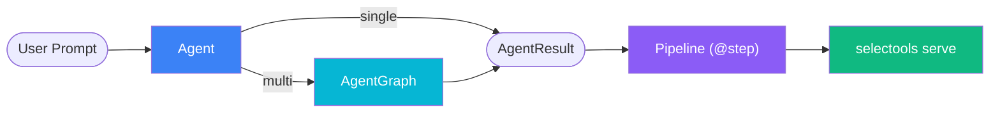
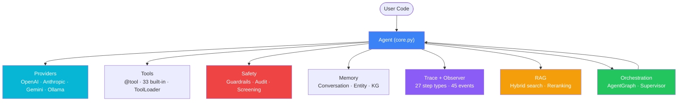
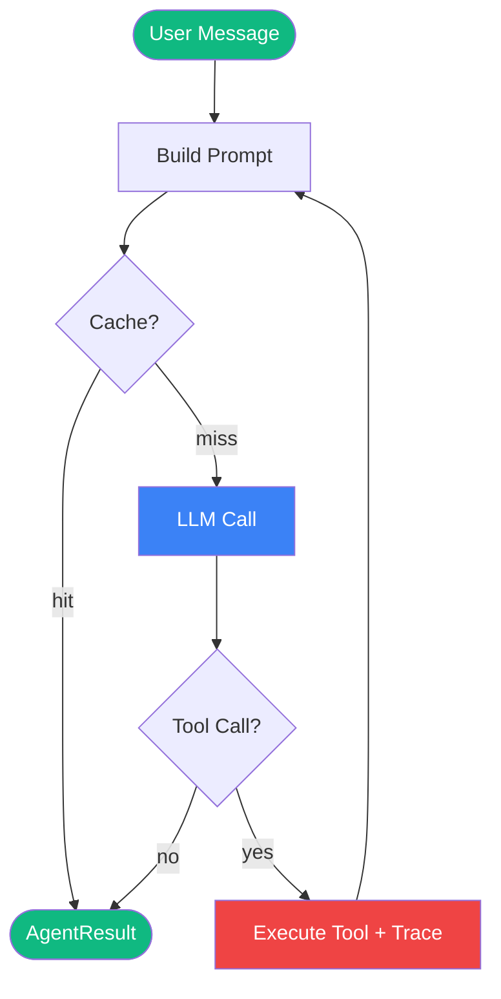
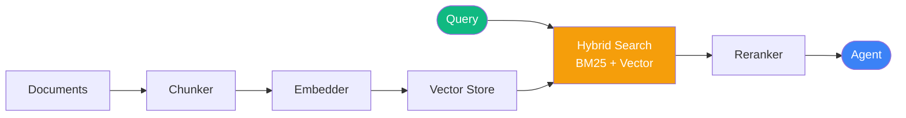
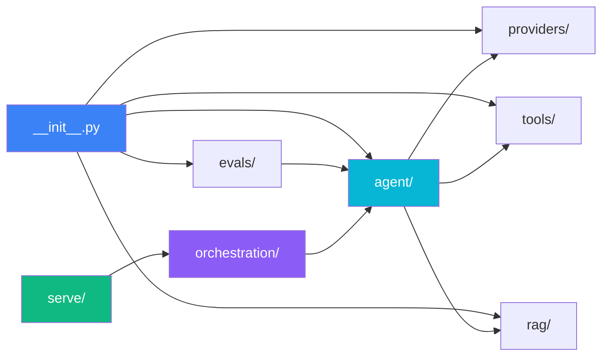
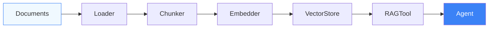
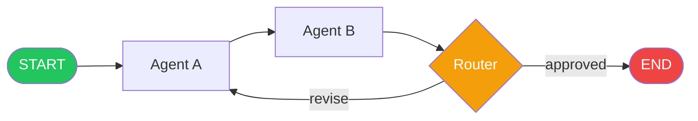
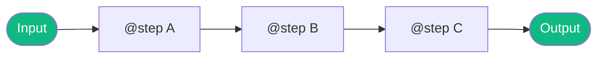
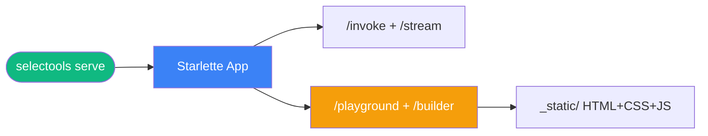

# Selectools Architecture

**Version:** 0.22.0
**Last Updated:** April 2026

## System Overview



**The flow:** User prompt → Agent (single or graph) → Pipeline composition → Serve as HTTP API or Visual Builder.

## Table of Contents

1. [Overview](#overview)
2. [System Architecture](#system-architecture)
3. [Core Components](#core-components)
4. [Data Flow](#data-flow)
5. [Module Dependencies](#module-dependencies)
6. [Design Principles](#design-principles)
7. [RAG Integration](#rag-integration)
8. [Multi-Agent Orchestration](#multi-agent-orchestration)
9. [Composable Pipelines](#composable-pipelines)
10. [Serve and Deploy](#serve-and-deploy)

---

## Overview

Selectools is a production-ready Python framework for building AI agents with tool-calling capabilities and Retrieval-Augmented Generation (RAG). The library provides a unified interface across multiple LLM providers (OpenAI, Anthropic, Gemini, Ollama) and handles the complexity of tool execution, conversation management, cost tracking, and semantic search.

### Key Features

- **Provider-Agnostic**: Switch between OpenAI, Anthropic, Gemini, and Ollama with one line
- **Production-Ready**: Robust error handling, retry logic, timeouts, and validation
- **RAG Support**: 4 embedding providers, 4 vector stores, document loaders
- **Developer-Friendly**: Type hints, `@tool` decorator, automatic schema inference
- **Observable**: `AgentObserver` + `AsyncAgentObserver` protocol (45 events with `run_id`), `LoggingObserver`, `SimpleStepObserver`, analytics, usage tracking, and cost monitoring (legacy hooks deprecated)
- **Native Tool Calling**: OpenAI, Anthropic, and Gemini native function calling APIs
- **Streaming**: E2E token-level streaming with native tool call support via `Agent.astream`
- **Parallel Execution**: Concurrent tool execution via `asyncio.gather` / `ThreadPoolExecutor`
- **Response Caching**: Built-in LRU+TTL cache (`InMemoryCache`) and distributed `RedisCache`
- **Structured Output**: Pydantic / JSON Schema `response_format` with auto-retry on validation failure
- **Execution Traces**: `AgentTrace` with typed `TraceStep` timeline on every `run()` / `arun()`
- **Reasoning Visibility**: `result.reasoning` surfaces *why* the agent chose a tool
- **Provider Fallback**: `FallbackProvider` with priority ordering and circuit breaker
- **Batch Processing**: `agent.batch()` / `agent.abatch()` for concurrent multi-prompt execution
- **Tool Policy Engine**: Declarative allow/review/deny rules with human-in-the-loop approval
- **Tool-Pair-Aware Trimming**: Memory sliding window preserves tool_use/tool_result pairs
- **Guardrails Engine**: Input/output content validation with block/rewrite/warn actions
- **Audit Logging**: JSONL audit trail with privacy controls (full/keys-only/hashed/none)
- **Tool Output Screening**: Pattern-based prompt injection detection (15 built-in patterns)
- **Coherence Checking**: LLM-based intent verification for tool calls
- **Persistent Sessions**: SessionStore protocol with JSON file, SQLite, and Redis backends
- **Summarize-on-Trim**: LLM-generated summaries of trimmed messages
- **Entity Memory**: Auto-extract named entities with LRU-pruned registry
- **Knowledge Graph**: Relationship triple extraction and keyword-based querying
- **Cross-Session Knowledge**: Daily logs + persistent facts with auto-registered `remember` tool
- **Multi-Agent Orchestration**: Compose agents into directed graphs with routing, parallel execution, checkpointing, and human-in-the-loop support
- **Agent Patterns**: PlanAndExecuteAgent, ReflectiveAgent, DebateAgent, TeamLeadAgent
- **Composable Pipelines**: `Pipeline` + `@step` + `|` operator + `parallel()` + `branch()`
- **Eval Framework**: 50 evaluators (29 deterministic + 21 LLM-as-judge), A/B testing, regression detection, HTML reports, JUnit XML, snapshot testing, live dashboard
- **MCP Support**: MCPClient, MCPServer, MultiMCPClient with circuit breaker
- **Serve and Deploy**: `selectools serve` with FastAPI/Starlette, YAML config, playground, Visual Agent Builder
- **Visual Builder**: Drag-drop AgentGraph UI with YAML/Python export, serverless mode for GitHub Pages deployment
- **Stability Markers**: `@stable`, `@beta`, `@deprecated(since, replacement)` on all public APIs

---

## System Architecture



**Agent responsibilities:** Iterative tool-calling loop, structured output parsing, execution traces, reasoning extraction, error handling with retries, observer notifications, parallel tool execution, batch processing, response caching, input/output guardrails, tool output screening, coherence checking, audit logging, session persistence, and memory context injection (entity, KG, knowledge).

---

## Core Components

### 1. Agent (`agent/core.py`)

The **Agent** is the orchestrator that manages the iterative loop of:

1. Sending messages to the LLM provider
2. Parsing responses for tool calls (with optional structured output validation)
3. Evaluating tool policies and requesting human approval if needed
4. Executing requested tools
5. Feeding results back to the LLM
6. Recording execution traces for every step
7. Repeating until task completion or max iterations

**Key Responsibilities:**

- Conversation management with optional memory
- Structured output parsing and validation (`response_format`)
- Execution trace recording (`AgentTrace` on every run)
- Reasoning extraction from LLM responses
- Tool policy enforcement (allow/review/deny)
- Human-in-the-loop approval for flagged tools
- Batch processing (`batch()` / `abatch()`)
- Retry logic with exponential backoff
- Rate limit detection and handling
- Tool timeout enforcement
- Hook invocation for observability
- Async/sync execution support
- Parallel tool execution for concurrent multi-tool calls
- Streaming responses via `astream()`
- Response caching to avoid redundant LLM calls

**Internal structure**: The Agent class is composed from 4 mixins for maintainability:
`_ToolExecutorMixin` (tool pipeline), `_ProviderCallerMixin` (LLM calls),
`_LifecycleMixin` (observer notification), `_MemoryManagerMixin` (memory/session/entity).
All public methods remain on `Agent`. Configuration is split across `config.py` (AgentConfig)
and `config_groups.py` (grouped config helpers).

### 2. Tools (`tools.py`)

**Tools** are Python functions that agents can invoke. The tool system provides:

- Automatic JSON schema generation from type hints
- Runtime parameter validation with helpful error messages
- Support for sync/async and streaming (Generator/AsyncGenerator)
- Injected kwargs for clean separation of concerns
- `@tool` decorator for ergonomic definition
- `ToolRegistry` for organization

### 3. Providers (`providers/`)

**Providers** are adapters that translate between the library's unified interface and specific LLM APIs:

- `OpenAIProvider` - OpenAI Chat Completions
- `AnthropicProvider` - Claude Messages API
- `GeminiProvider` - Google Generative AI
- `OllamaProvider` - Local LLM execution

Each implements the `Provider` protocol with `complete()`, `stream()`, `acomplete()`, and `astream()` methods. Native tool calling is supported via the `tools` parameter.

### 4. Parser (`parser.py`)

**ToolCallParser** robustly extracts `TOOL_CALL` directives from LLM responses:

- Handles fenced code blocks, inline JSON, mixed content
- Balanced bracket parsing for nested JSON
- Lenient JSON parsing with fallbacks
- Supports variations: `tool_name`/`tool`/`name` and `parameters`/`params`

### 5. Prompt Builder (`prompt.py`)

**PromptBuilder** generates system prompts with:

- Tool calling contract specification
- JSON schema for each available tool
- Best practices and constraints
- Customizable base instructions

### 6. Memory (`memory.py`)

**ConversationMemory** maintains multi-turn dialogue history:

- Sliding window with configurable limits (message count, token count)
- Automatic pruning when limits exceeded
- Tool-pair-aware trimming: never orphans a tool_use without its tool_result
- Summarize-on-trim: LLM-generated summaries of trimmed messages
- Integrates seamlessly with Agent

### 6a. Persistent Sessions (`sessions.py`)

**SessionStore** protocol with three backends for saving/loading `ConversationMemory`:

- `JsonFileSessionStore` — file-based, one JSON file per session
- `SQLiteSessionStore` — single database, JSON column
- `RedisSessionStore` — distributed, server-side TTL
- Auto-save after each run, auto-load on init via `AgentConfig`

### 6b. Entity Memory (`entity_memory.py`)

**EntityMemory** auto-extracts named entities from conversation using an LLM:

- Tracks name, type, attributes, mention count, timestamps
- Deduplication by name (case-insensitive) with attribute merging
- LRU pruning when over `max_entities`
- Injects `[Known Entities]` context into system prompt

### 6c. Knowledge Graph Memory (`knowledge_graph.py`)

**KnowledgeGraphMemory** extracts relationship triples from conversation:

- `Triple` dataclass: subject, relation, object, confidence
- `TripleStore` protocol with in-memory and SQLite backends
- Keyword-based query for relevant triples
- Injects `[Known Relationships]` context into system prompt

### 6d. Cross-Session Knowledge (`knowledge.py`)

**KnowledgeMemory** provides durable cross-session memory:

- Daily log files (`YYYY-MM-DD.log`) for recent entries
- Persistent `MEMORY.md` for long-term facts
- Auto-registered `remember` tool for explicit knowledge storage
- Injects `[Long-term Memory]` + `[Recent Memory]` into system prompt

### 7. RAG System (`rag/`)

The **RAG module** provides end-to-end document search:

- **DocumentLoader**: Load from files, directories, PDFs
- **TextSplitter**: Chunk documents intelligently
- **EmbeddingProvider**: Generate vector embeddings
- **VectorStore**: Store and search embeddings
- **RAGTool**: Pre-built knowledge base search tool
- **RAGAgent**: High-level API for RAG agents

### 8. Usage Tracking (`usage.py`, `pricing.py`)

Automatic monitoring of:

- Token consumption (prompt, completion, embedding)
- Cost estimation (per model from registry)
- Per-tool attribution
- Iteration-by-iteration breakdown

### 9. Analytics (`analytics.py`)

Tool usage analytics with:

- Call counts and success rates
- Execution timing
- Parameter patterns
- Streaming metrics
- Export to JSON/CSV

### 10. Structured Output (`structured.py`)

Enforces typed responses from LLMs:

- Pydantic `BaseModel` or dict JSON Schema support
- Schema instruction injection into system prompt
- JSON extraction from LLM response text
- Validation with auto-retry on failure
- `result.parsed` returns the typed object

### 11. Execution Traces (`trace.py`)

Structured timeline of every agent execution:

- 26 `TraceStep` types including `llm_call`, `tool_selection`, `tool_execution`, `cache_hit`, `error`, `structured_retry`, `session_load`, `session_save`, `memory_summarize`, `entity_extraction`, `kg_extraction`, plus 10 graph-specific types (`graph_node_start`, `graph_node_end`, `graph_routing`, etc.)
- Captures timestamps, durations, input/output summaries, token usage
- `AgentTrace` container with `.to_dict()`, `.to_json()`, `.timeline()`, `.filter()`
- Always populated on `result.trace` — zero cost when not accessed

### 12. Tool Policy (`policy.py`)

Declarative tool execution safety:

- Glob-based `allow`, `review`, `deny` rules
- Argument-level `deny_when` conditions
- Evaluation order: deny → review → allow → default (review)
- Integration point in agent loop before tool execution

### 13. Provider Fallback (`providers/fallback.py`)

Resilient provider orchestration:

- Wraps multiple providers in priority order
- Automatic failover on timeout, 5xx, rate limit, connection error
- Circuit breaker: skip failed providers for configurable cooldown
- `on_fallback` callback for observability

### 14. AgentObserver Protocol (`observer.py`)

Class-based lifecycle observability:

- 45 event methods with `run_id` correlation for concurrent requests
- `call_id` for matching parallel tool start/end pairs
- `AsyncAgentObserver` provides async equivalents of all observer events
- Built-in `LoggingObserver` for structured JSON log output
- OpenTelemetry span export via `AgentTrace.to_otel_spans()`
- Designed for Langfuse, Datadog, custom integrations
- Legacy hooks (`AgentConfig(hooks={...})`) are deprecated in favor of observers

### 15. Model Registry (`models.py`)

Single source of truth for 152 models:

- Pricing per 1M tokens
- Context windows
- Max output tokens
- Typed constants for IDE autocomplete

---

## Data Flow

### Standard Tool-Calling Flow



### RAG-Enhanced Flow



---

## Module Dependencies



**Module breakdown:**

- **agent/core.py** depends on: types, tools, prompt, parser, structured, trace, policy, providers, memory, usage, observer, cache, sessions, entity_memory, knowledge_graph, knowledge, guardrails, security
- **providers/** each depend on: types, usage, pricing, and their SDK
- **rag/** depends on: embeddings, types
- **evals/** depends on: agent (for `_clone_for_isolation`), types, providers
- **orchestration/** depends on: agent, types, trace, observer
- **serve/** depends on: agent, orchestration, pipeline, templates

### Import Guidelines

- **Core modules** (`types`, `tools`, `agent`) have minimal dependencies
- **Providers** depend only on core modules and their SDK
- **RAG system** is self-contained, depends on `agent` only for `RAGAgent`
- **Eval framework** depends on `agent` (for `_clone_for_isolation`) and `types` (for `Message`, `AgentResult`)
- **Optional dependencies** (ChromaDB, Pinecone, etc.) are lazy-loaded

---

## Design Principles

### 1. Provider Agnosticism

**Problem:** Each LLM provider has different APIs, message formats, and capabilities.

**Solution:** The `Provider` protocol defines a unified interface. Providers handle translation:

- Message format conversion
- Role mapping (e.g., `TOOL` → `ASSISTANT` for OpenAI)
- Image encoding (base64 for vision)
- Streaming implementation

**Benefit:** Switch providers with one line change, no refactoring.

### 2. Library-First Design

**Problem:** Frameworks often take over your application with magic globals and hidden state.

**Solution:** Selectools is a library you import and compose:

- No global state
- Explicit dependency injection
- Use as much or as little as needed
- Integrates with existing code

**Benefit:** Full control, no framework lock-in.

### 3. Production Hardening

**Problem:** Real-world LLM applications fail in ways demos don't.

**Solution:** Built-in robustness:

- **Retry logic**: Exponential backoff for rate limits
- **Timeouts**: Request-level and tool-level
- **Validation**: Early parameter checking with helpful errors
- **Error recovery**: Lenient parsing, fallback strategies
- **Iteration caps**: Prevent runaway costs

**Benefit:** Reliable in production environments.

### 4. Developer Ergonomics

**Problem:** Boilerplate code slows development.

**Solution:** Minimal API surface:

- `@tool` decorator with auto schema inference
- Type hints generate JSON schemas
- Default values make parameters optional
- IDE autocomplete for all models
- Clear error messages with suggestions

**Benefit:** Fast prototyping, maintainable code.

### 5. Type Safety

**Problem:** Runtime errors from typos and type mismatches.

**Solution:** Full type hints everywhere:

- `ModelInfo` dataclass for model metadata
- Typed constants (`OpenAI.GPT_4O`)
- Protocol-based interfaces
- MyPy compatibility

**Benefit:** Catch errors at development time.

### 6. Observability

**Problem:** Black box behavior makes debugging hard.

**Solution:** `AgentObserver` protocol (45 lifecycle events including 13 graph events, `run_id` correlation):

- `on_run_start/end`, `on_iteration_start/end`
- `on_tool_start/end/error/chunk`
- `on_llm_start/end`
- `on_error`, `on_guardrail_triggered`, `on_coherence_blocked`, ...
- `AsyncAgentObserver` for async-native observers

Legacy hooks (`AgentConfig(hooks={...})`) are deprecated. Use `AgentConfig(observers=[...])` instead.

**Benefit:** Full visibility into agent behavior.

### 7. Cost Awareness

**Problem:** Unpredictable LLM costs.

**Solution:** Automatic tracking:

- Token counting per request
- Cost calculation per model
- Per-tool attribution
- Warning thresholds
- Embedding cost tracking (RAG)

**Benefit:** Budget control and optimization.

### 8. Performance

**Problem:** Sequential tool execution wastes time when tools are independent.

**Solution:** Automatic parallel execution:

- `asyncio.gather()` for async (`arun`, `astream`)
- `ThreadPoolExecutor` for sync (`run`)
- Results preserved in original order
- Enabled by default, configurable via `parallel_tool_execution`

**Benefit:** Faster agent loops when LLM requests multiple independent tools.

### 9. Response Caching

**Problem:** Identical LLM requests are expensive and wasteful.

**Solution:** Pluggable cache layer:

- `Cache` protocol for custom backends
- `InMemoryCache`: LRU + TTL with `OrderedDict`, thread-safe, zero dependencies
- `RedisCache`: Distributed TTL cache for multi-process deployments
- Deterministic key generation via `CacheKeyBuilder` (SHA-256 hash)
- Opt-in via `AgentConfig(cache=InMemoryCache())`

**Benefit:** Eliminate redundant LLM calls, reduce cost and latency.

---

## RAG Integration

### Architecture

The RAG system is designed as a composable pipeline:



Each component can be used independently or combined via `RAGAgent` high-level API.

### Document Processing Pipeline

1. **Loading**: `DocumentLoader` supports text, files, directories, PDFs
2. **Chunking**: `TextSplitter` / `RecursiveTextSplitter` with overlap
3. **Embedding**: Provider-agnostic embedding interface
4. **Storage**: VectorStore abstraction (Memory, SQLite, Chroma, Pinecone)
5. **Retrieval**: Semantic search with score thresholds

### Vector Store Abstraction

All vector stores implement the same interface:

- `add_documents(documents, embeddings)` → ids
- `search(query_embedding, top_k, filter)` → SearchResults
- `delete(ids)`
- `clear()`

This allows switching backends without changing agent code.

### RAGAgent High-Level API

Three convenient constructors:

- `RAGAgent.from_documents(docs, provider, store)` - Direct document list
- `RAGAgent.from_directory(path, provider, store)` - Load from folder
- `RAGAgent.from_files(paths, provider, store)` - Load specific files

All handle chunking, embedding, and tool setup automatically.

### Cost Tracking

RAG operations track both:

- **LLM costs**: Standard token counting
- **Embedding costs**: Per-token embedding API costs

Total cost = LLM cost + Embedding cost

---

## Extension Points

### Adding a New Provider

1. Implement the `Provider` protocol in `providers/`
2. Define `complete()`, `stream()`, `acomplete()`, and `astream()` methods
3. Handle message formatting in `_format_messages()`
4. Map roles and content appropriately
5. Extract usage stats and calculate cost
6. Pass the `tools` parameter to all methods (including streaming)

### Adding a New Vector Store

1. Inherit from `VectorStore` abstract base class
2. Implement: `add_documents()`, `search()`, `delete()`, `clear()`
3. Register in `VectorStore.create()` factory
4. Add to `rag/stores/` directory

### Adding a New Tool

```python
from selectools import tool

@tool(description="Your tool description")
def my_tool(param1: str, param2: int = 10) -> str:
    """Tool implementation."""
    return f"Result: {param1}, {param2}"
```

Schema is auto-generated from type hints and defaults.

### Custom Observers

```python
from selectools.observer import AgentObserver

class MyObserver(AgentObserver):
    def on_tool_start(self, run_id, call_id, tool_name, args):
        print(f"[{run_id[:8]}] Tool: {tool_name}, Args: {args}")

config = AgentConfig(observers=[MyObserver()])
agent = Agent(tools=[...], provider=provider, config=config)
```

> **Note:** Legacy hooks (`AgentConfig(hooks={...})`) are deprecated. Use `observers` instead.

---

## Performance Considerations

### Token Efficiency

- Use smaller models (GPT-4o-mini, Haiku) when appropriate
- Limit conversation history with `ConversationMemory`
- Set `max_tokens` to prevent over-generation
- Use `top_k` parameter to limit RAG context

### Async for Concurrency

- Use `Agent.arun()` for non-blocking execution
- Async tools with `async def`
- Concurrent requests with `asyncio.gather()`
- Parallel tool execution via `Agent.astream()` with `asyncio.gather()`
- Better performance in web frameworks (FastAPI)

### Vector Store Selection

- **Memory**: Fast, but not persistent (prototyping)
- **SQLite**: Good balance, local persistence
- **Chroma**: Advanced features, 10k+ documents
- **Pinecone**: Cloud-hosted, production scale

### Response Caching

Built-in caching avoids redundant LLM calls for identical requests:

- **`InMemoryCache`**: Thread-safe LRU + TTL cache, zero dependencies
- **`RedisCache`**: Distributed TTL cache for multi-process / multi-server deployments
- Cache key is a SHA-256 hash of (model, system_prompt, messages, tools, temperature)
- Streaming (`astream`) bypasses cache (non-replayable)
- Cache hits still contribute to usage tracking

```python
from selectools import Agent, AgentConfig, InMemoryCache

cache = InMemoryCache(max_size=500, default_ttl=600)
config = AgentConfig(cache=cache)
agent = Agent(tools=[...], provider=provider, config=config)

# Second identical call returns cached response (no LLM call)
response1 = agent.run([Message(role=Role.USER, content="Hello")])
agent.reset()
response2 = agent.run([Message(role=Role.USER, content="Hello")])

print(cache.stats)  # CacheStats(hits=1, misses=1, ...)
```

### General Caching Tips

- Keep `VectorStore` instance alive between queries
- Reuse `Agent` instance for same tool set
- Batch embedding operations with `embed_texts()`

---

## Testing Strategy

### Unit Tests

- Core modules tested in isolation
- Mock providers for agent logic
- Schema validation edge cases
- Parser robustness tests

### Integration Tests

- Full agent loops with real providers
- RAG pipeline end-to-end
- Multi-turn conversations with memory
- Error scenarios and recovery

### Fixtures

- `LocalProvider` for offline testing
- `SELECTOOLS_BBOX_MOCK_JSON` for deterministic tool calls
- Mock vector stores for RAG tests

---

## Multi-Agent Orchestration

The orchestration layer (v0.18.0) enables composing multiple agents into directed graphs with automatic routing, parallel execution, and human-in-the-loop support.

### Architecture



Key components: `GraphState` (shared state), `GraphNode` (wraps any Agent or callable), routing (static, conditional, scatter fan-out), `ParallelGroupNode` (asyncio.gather + MergePolicy), `CheckpointStore` (InMemory / File / SQLite), HITL via `yield InterruptRequest()`. `SupervisorAgent` adds 4 strategies: plan_and_execute, round_robin, dynamic, magentic.

### Key Design Decisions

1. **Plain Python routing** — Router functions are plain `def route(state) -> str`. No compile step, no Pregel, no DSL.

2. **Generator-node HITL** — Nodes that need human input are Python generators. `yield InterruptRequest(...)` pauses at the exact yield point. On resume, the graph injects the response via `gen.asend()`. This avoids LangGraph's documented foot-gun where the entire node re-executes on resume.

3. **ContextMode prevents context explosion** — Each node declares how much conversation history it receives. `LAST_MESSAGE` (default) sends only the most recent user message, preventing unbounded token growth across long chains.

4. **Agents are the primitives** — `AgentGraph` composes existing `Agent` instances. No new "graph agent" abstraction needed. Any callable `(GraphState) -> GraphState` also works as a node.

### Trace Integration

Graph execution produces 10 new `StepType` values (`graph_node_start`, `graph_node_end`, `graph_routing`, etc.) and fires 13 new observer events, fully integrated with the existing `AgentTrace` and `AgentObserver` infrastructure.

---

## Composable Pipelines

The pipeline system (v0.18.0) enables composing processing steps with the `|` operator:



**Key features:**

- **`@step` decorator**: Define typed pipeline steps with input/output contracts
- **`|` operator**: Chain steps with `step_a | step_b | step_c`
- **`parallel()`**: Execute independent steps concurrently
- **`branch()`**: Conditional routing based on step output
- **`StepResult`**: Each step returns a typed result with metadata
- **Type-safe contracts**: Input/output types are checked at composition time

Pipelines compose with both `AgentResult` and `GraphResult`, enabling workflows like: Agent -> Pipeline -> Serve.

---

## Serve and Deploy

The serve layer (v0.19.0+) provides HTTP deployment and a visual builder for agent graphs.

### Architecture



### Serve Module Structure

| File | Purpose |
|------|---------|
| `cli.py` | CLI entry point (`selectools serve` command) |
| `app.py` | FastAPI/Starlette app factory and route registration |
| `_starlette_app.py` | Starlette ASGI application (411 lines) |
| `models.py` | Pydantic request/response models |
| `playground.py` | Interactive playground HTML endpoint |
| `builder.py` | 18-line assembler that inlines CSS/JS into self-contained HTML |
| `_static/` | Builder source files: `builder.html`, `builder.css`, `builder.js` |

### Visual Agent Builder

The builder (`selectools serve --builder`) provides a drag-drop UI for constructing `AgentGraph` workflows:

- **Serverless mode**: The builder is a self-contained HTML file with all CSS and JS inlined. It can be deployed to GitHub Pages or any static host with zero backend.
- **Export formats**: YAML config and Python code generation
- **Live test**: Execute graphs directly from the builder UI
- **Node types**: Agent nodes, parallel groups, subgraph nodes, conditional routing

### Templates

Five built-in agent templates in `templates/`:

- `code_reviewer.py` — Code review agent
- `customer_support.py` — Customer support agent
- `data_analyst.py` — Data analysis agent
- `rag_chatbot.py` — RAG-powered chatbot
- `research_assistant.py` — Research assistant agent

---

## Further Reading

- [Agent Module](modules/AGENT.md) - Detailed agent loop documentation
- [Tools Module](modules/TOOLS.md) - Tool system deep dive
- [RAG System](modules/RAG.md) - Complete RAG pipeline
- [Providers](modules/PROVIDERS.md) - Provider implementations
- [Model Registry](modules/MODELS.md) - Model metadata system
- [Builder Module](modules/builder.md) - Visual Agent Builder

---

**Next:** Explore individual module documentation for implementation details.
