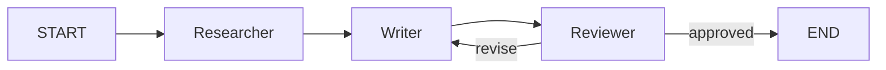

# Orchestration Module

**Import:** `from selectools import AgentGraph, GraphState, GraphNode`
**Stability:** <span class="badge-beta">beta</span>
**Since:** v0.18.0

```python title="multi_agent_pipeline.py"
from selectools import Agent, AgentConfig, AgentGraph
from selectools.providers.stubs import LocalProvider

# Create specialized agents
researcher = Agent(
    tools=[],
    provider=LocalProvider(),
    config=AgentConfig(model="gpt-4o", system_prompt="You are a researcher."),
)
writer = Agent(
    tools=[],
    provider=LocalProvider(),
    config=AgentConfig(model="gpt-4o", system_prompt="You are a writer."),
)
reviewer = Agent(
    tools=[],
    provider=LocalProvider(),
    config=AgentConfig(model="gpt-4o", system_prompt="You are an editor."),
)

# Build graph: researcher -> writer -> reviewer
graph = AgentGraph()
graph.add_node("researcher", researcher)
graph.add_node("writer", writer)
graph.add_node("reviewer", reviewer)
graph.add_edge("researcher", "writer")
graph.add_edge("writer", "reviewer")
graph.add_edge("reviewer", AgentGraph.END)
graph.set_entry("researcher")

result = graph.run("Write a blog post about AI agents")
print(result.content)
print(f"Steps: {result.steps}, Cost: ${result.total_usage.cost_usd:.4f}")
```



!!! tip "See Also"
    - [Agent](AGENT.md) -- the Agent class that powers each graph node
    - [Supervisor](SUPERVISOR.md) -- high-level multi-agent coordination
    - [Pipeline](PIPELINE.md) -- composable pipelines with @step and | operator
    - [Sessions](SESSIONS.md) -- persistent session storage (complementary to checkpointing)

---

**Added in:** v0.18.0
**Package:** `src/selectools/orchestration/`
**Classes:** `AgentGraph`, `GraphState`, `GraphNode`, `GraphResult`, `SupervisorAgent`

## Table of Contents

1. [Overview](#overview)
2. [Quick Start](#quick-start)
3. [GraphState](#graphstate)
4. [GraphNode](#graphnode)
5. [ContextMode](#contextmode)
6. [Routing](#routing)
7. [Parallel Execution](#parallel-execution)
8. [Human-in-the-Loop (HITL)](#human-in-the-loop-hitl)
9. [Checkpointing](#checkpointing)
10. [Subgraphs](#subgraphs)
11. [Error Handling](#error-handling)
12. [Loop & Stall Detection](#loop-stall-detection)
13. [Budget & Cancellation](#budget-cancellation)
14. [Streaming](#streaming)
15. [Visualization](#visualization)
16. [Observer Events](#observer-events)
17. [Trace Steps](#trace-steps)
18. [GraphResult](#graphresult)
19. [API Reference](#api-reference)
20. [Examples](#examples)

---

## Overview

The **orchestration** module provides `AgentGraph` -- a directed graph engine for composing multiple selectools `Agent` instances (or plain callables) into multi-step workflows. It covers the same ground as LangGraph but with a fundamentally different design philosophy.

### Why AgentGraph?

| | AgentGraph | LangGraph |
|---|---|---|
| **Routing** | Plain Python functions | Pregel-based DSL + `compile()` step |
| **HITL** | Generator nodes; resumes at exact `yield` point | Restarts entire node from scratch |
| **Context** | `ContextMode.LAST_MESSAGE` prevents explosion by default | Full history forwarded by default |
| **Composition** | Graph is callable -- nest as `graph(state)` | Separate subgraph API |
| **Dependencies** | Zero extra deps (pure Python) | langgraph, langgraph-checkpoint, ... |

### Key Differentiators

- **Plain Python routing.** No compile step, no Pregel runtime, no custom DSL. Routing functions are ordinary `Callable[[GraphState], str]` that return the next node name.
- **Generator-node HITL.** When a generator node yields `InterruptRequest`, the graph checkpoints and returns. On `resume()`, execution continues from the exact `yield` point -- not by re-running the entire node. This means expensive computation before the yield is preserved.
- **Context explosion prevention.** `ContextMode.LAST_MESSAGE` is the default for every node. Each agent only sees the most recent output, not the entire accumulated history. Override per-node when needed.
- **Graph-as-callable.** Every `AgentGraph` implements `__call__(state) -> state`, so it can be used as a node in another graph without any adapter.

---

## Quick Start

### One-Liner Pipeline

```python
# Simplest possible multi-agent pipeline:
result = AgentGraph.chain(planner_agent, writer_agent, reviewer_agent).run("Write a blog post")

# Equivalent to the manual wiring below:
```

### Manual Wiring

A minimal 3-node linear pipeline in 15 lines:

```python
from selectools import Agent, AgentConfig, AgentGraph, GraphState
from selectools.providers.stubs import LocalProvider

# Create agents (use real providers in production)
planner = Agent(config=AgentConfig(model="gpt-5-mini"), provider=LocalProvider())
writer = Agent(config=AgentConfig(model="gpt-5-mini"), provider=LocalProvider())
reviewer = Agent(config=AgentConfig(model="gpt-5-mini"), provider=LocalProvider())

# Build graph
graph = AgentGraph()
graph.add_node("planner", planner)
graph.add_node("writer", writer)
graph.add_node("reviewer", reviewer)
graph.add_edge("planner", "writer")
graph.add_edge("writer", "reviewer")
graph.add_edge("reviewer", AgentGraph.END)
graph.set_entry("planner")

# Run
result = graph.run("Write a blog post about AI agents")
print(result.content)
print(f"Steps: {result.steps}, Cost: ${result.total_usage.cost_usd:.4f}")
```

For async usage, replace `graph.run(...)` with `await graph.arun(...)`.

### Common Patterns

```python
# Linear pipeline — one line
graph = AgentGraph.chain(agent_a, agent_b, agent_c)

# Pipeline with named nodes
graph = AgentGraph.chain(agent_a, agent_b, names=["planner", "writer"])

# Inline edge creation
graph = AgentGraph()
graph.add_node("a", agent_a, next_node="b")
graph.add_node("b", agent_b, next_node=AgentGraph.END)

# Auto-entry: first add_node() sets entry automatically
graph = AgentGraph()
graph.add_node("start", agent_a)  # entry is "start" automatically
```

---

## GraphState

**File:** `src/selectools/orchestration/state.py`

`GraphState` is the shared context object passed between every node in the graph. All state mutation is explicit -- nodes receive the current state and return a new (or mutated) state.

### Fields

| Field | Type | Description |
|---|---|---|
| `messages` | `List[Message]` | Accumulated conversation messages across all nodes (append-only). |
| `data` | `Dict[str, Any]` | Inter-node key-value store. The canonical handoff key is `STATE_KEY_LAST_OUTPUT`. |
| `current_node` | `str` | Name of the currently executing node (set by the engine). |
| `history` | `List[Tuple[str, AgentResult]]` | Ordered list of `(node_name, result)` from completed nodes. |
| `metadata` | `Dict[str, Any]` | User-attached data carried through checkpoints (request_id, user_id, etc.). |
| `errors` | `List[Dict[str, Any]]` | Error records from failed nodes (populated when `error_policy=SKIP`). |

### Creating State

```python
from selectools import GraphState

# From a prompt string (most common)
state = GraphState.from_prompt("Summarize the latest AI research")

# From scratch with custom data
state = GraphState(
    messages=[Message(role=Role.USER, content="Hello")],
    data={"topic": "AI safety", "max_words": 500},
    metadata={"request_id": "req-42", "user_id": "alice"},
)
```

### Accessing `last_output`

```python
# Property access (preferred):
state.last_output = "new value"
print(state.last_output)

# Equivalent to:
state.data[STATE_KEY_LAST_OUTPUT] = "new value"
```

### Serialization

```python
# Save state to JSON
data = state.to_dict()
import json
with open("state.json", "w") as f:
    json.dump(data, f)

# Restore state
with open("state.json") as f:
    restored = GraphState.from_dict(json.load(f))
```

`to_dict()` excludes internal `_interrupt_responses` -- those are preserved separately by the checkpoint system.

---

## GraphNode

**File:** `src/selectools/orchestration/node.py`

Each node wraps an `Agent`, an async callable, a sync callable, or an async generator function.

### Wrapping an Agent

```python
from selectools import Agent, AgentConfig, AgentGraph
from selectools.orchestration import ContextMode

graph = AgentGraph()
graph.add_node("writer", writer_agent)
```

When the node executes, the engine calls `agent.arun(messages)` with messages built from `context_mode`.

### Wrapping a Plain Callable

Any callable that accepts `GraphState` and returns `GraphState` (or `None` to pass through) works:

```python
def enrich(state: GraphState) -> GraphState:
    state.data["enriched"] = True
    state.data["__last_output__"] = "Enrichment complete"
    return state

graph.add_node("enrich", enrich)
```

Async callables are also supported:

```python
async def fetch_data(state: GraphState) -> GraphState:
    state.data["results"] = await external_api_call(state.data["query"])
    return state

graph.add_node("fetch", fetch_data)
```

### Input and Output Transforms

For fine-grained control over what a node sees and how it writes back:

```python
from selectools import Message, Role
from selectools.orchestration import STATE_KEY_LAST_OUTPUT

def custom_input(state: GraphState) -> list:
    """Build a task-specific prompt from state data."""
    topic = state.data.get("topic", "general")
    return [Message(role=Role.USER, content=f"Write about: {topic}")]

def custom_output(result, state: GraphState) -> GraphState:
    """Store result under a custom key instead of __last_output__."""
    state.data["draft"] = result.content
    state.data[STATE_KEY_LAST_OUTPUT] = result.content
    state.history.append((state.current_node, result))
    return state

graph.add_node(
    "writer",
    writer_agent,
    input_transform=custom_input,
    output_transform=custom_output,
)
```

### Node Parameters

| Parameter | Default | Description |
|---|---|---|
| `context_mode` | `LAST_MESSAGE` | Controls what history is forwarded to the agent. |
| `context_n` | `6` | Message count for `LAST_N` mode. |
| `max_iterations` | `1` | Re-execution count within a single visit. |
| `max_visits` | `0` | Max times this node may execute in a run (0 = unlimited). |
| `error_policy` | `None` | Per-node override; `None` inherits from the graph. |

---

## ContextMode

**File:** `src/selectools/orchestration/state.py`

Controls what conversation history is forwarded to a node's agent. The default `LAST_MESSAGE` prevents context explosion -- each agent only sees the most recent output, not the entire accumulated graph history.

### Modes

| Mode | Behavior |
|---|---|
| `LAST_MESSAGE` | Only the most recent user message. **Default.** |
| `LAST_N` | Last N messages (configurable via `context_n`). |
| `FULL` | Full `state.messages` history. |
| `SUMMARY` | Provider-compressed summary of prior messages. |
| `CUSTOM` | Delegates entirely to `input_transform`. |

### Examples

```python
from selectools.orchestration import ContextMode

# Default -- each agent sees only the latest output (prevents context explosion)
graph.add_node("summarizer", agent)

# Last 6 messages for agents that need recent context
graph.add_node("analyst", agent, context_mode=ContextMode.LAST_N, context_n=6)

# Full history for a final reviewer that needs complete context
graph.add_node("reviewer", agent, context_mode=ContextMode.FULL)

# Custom transform for maximum flexibility
graph.add_node(
    "specialist",
    agent,
    context_mode=ContextMode.CUSTOM,
    input_transform=lambda state: [Message(role=Role.USER, content=state.data["task"])],
)
```

---

## Routing

### Static Edges

Connect nodes in a fixed sequence with `add_edge()`:

```python
graph.add_edge("planner", "writer")
graph.add_edge("writer", "reviewer")
graph.add_edge("reviewer", AgentGraph.END)
```

If a node has no outgoing edge, execution ends implicitly.

### Conditional Edges

Route dynamically based on state with `add_conditional_edge()`:

```python
def route_after_review(state: GraphState) -> str:
    score = state.data.get("quality_score", 0)
    if score >= 8:
        return AgentGraph.END
    elif score >= 5:
        return "editor"
    else:
        return "writer"  # rewrite from scratch

graph.add_conditional_edge(
    "reviewer",
    route_after_review,
    path_map={
        "editor": "editor",
        "writer": "writer",
    },
)
```

The `path_map` is optional but recommended -- it enables compile-time validation that all routing destinations exist in the graph.

### Routing Primitives: `goto()` and `update()`

For routing functions that also need to mutate state:

```python
from selectools.orchestration import goto, update

def route_with_update(state: GraphState):
    if state.data.get("needs_revision"):
        return goto("writer")  # explicit routing directive
    return goto(AgentGraph.END)
```

`update()` returns a state patch directive applied before routing:

```python
from selectools.orchestration import update

def enrich_and_route(state: GraphState):
    state.data["enriched"] = True
    return update({"revision_count": state.data.get("revision_count", 0) + 1})
```

### Dynamic Fan-Out with `Scatter`

A routing function can return `Scatter` objects to create dynamic parallel branches:

```python
from selectools.orchestration import Scatter

def dynamic_fanout(state: GraphState):
    topics = state.data.get("topics", ["AI", "ML"])
    return [
        Scatter(node_name="researcher", state_patch={"topic": t})
        for t in topics
    ]

graph.add_conditional_edge("planner", dynamic_fanout)
```

Each `Scatter` gets its own deep-copied branch state with `state_patch` merged in. Results are merged via the default `MergePolicy.LAST_WINS`.

---

## Parallel Execution

**File:** `src/selectools/orchestration/node.py` (`ParallelGroupNode`)

### add_parallel_nodes()

Register a parallel group that fans out to child nodes and merges results:

```python
# Register individual nodes
graph.add_node("researcher_a", agent_a)
graph.add_node("researcher_b", agent_b)
graph.add_node("researcher_c", agent_c)

# Register parallel group
graph.add_parallel_nodes(
    "research_team",
    ["researcher_a", "researcher_b", "researcher_c"],
    merge_policy=MergePolicy.APPEND,
)

# Wire it into the graph
graph.add_edge("planner", "research_team")
graph.add_edge("research_team", "synthesizer")
graph.add_edge("synthesizer", AgentGraph.END)
graph.set_entry("planner")
```

Child nodes execute concurrently via `asyncio.gather`. Each branch receives a deep copy of the current state.

### MergePolicy

Controls how parallel branch states are merged after all branches complete:

| Policy | Behavior |
|---|---|
| `LAST_WINS` | On conflicting keys in `state.data`, the last branch's value wins. **Default.** |
| `FIRST_WINS` | On conflicting keys, the first branch's value wins. |
| `APPEND` | List values are concatenated across branches; non-list conflicts fall back to `LAST_WINS`. |

`messages`, `history`, and `errors` are always concatenated regardless of policy.

### Custom Merge Function

For full control over how branch results are combined:

```python
from selectools.orchestration import MergePolicy

def merge_research(branch_states: list) -> GraphState:
    """Combine research findings into a single state."""
    combined = GraphState()
    all_findings = []
    for s in branch_states:
        all_findings.append(s.data.get("findings", ""))
        combined.messages.extend(s.messages)
        combined.history.extend(s.history)

    combined.data["all_findings"] = all_findings
    combined.data["__last_output__"] = "\n\n".join(all_findings)
    return combined

graph.add_parallel_nodes(
    "research_team",
    ["researcher_a", "researcher_b"],
    merge_fn=merge_research,
)
```

When `merge_fn` is set, it overrides `merge_policy` entirely.

---

## Human-in-the-Loop (HITL)

Generator nodes enable pause/resume workflows where a human can review, approve, or modify intermediate results before execution continues.

### How It Works

1. A node is defined as an async generator function that yields `InterruptRequest`.
2. When the graph engine encounters the yield, it checkpoints state and returns `GraphResult(interrupted=True)`.
3. The caller inspects the interrupt, collects human input, and calls `graph.resume()`.
4. **Execution resumes at the exact yield point** -- not by restarting the node. Any computation before the yield is preserved.

### Example

```python
from selectools.orchestration import (
    AgentGraph, GraphState, InterruptRequest,
    FileCheckpointStore, STATE_KEY_LAST_OUTPUT,
)

async def review_node(state: GraphState):
    """Async generator node that pauses for human approval."""
    # Expensive analysis happens before the yield
    draft = state.data.get("__last_output__", "")
    state.data["analysis"] = f"Analysis of: {draft[:100]}..."

    # Pause here -- human sees the analysis and responds
    approval = yield InterruptRequest(
        prompt="Do you approve this draft?",
        payload={"analysis": state.data["analysis"], "draft": draft},
    )

    # Resumes here with the human's response
    state.data["approved"] = (approval == "yes")
    state.data[STATE_KEY_LAST_OUTPUT] = f"Review complete. Approved: {approval}"

# Build graph with checkpoint store (required for HITL)
store = FileCheckpointStore("./checkpoints")

graph = AgentGraph()
graph.add_node("writer", writer_agent)
graph.add_node("review", review_node)
graph.add_node("publisher", publisher_agent)
graph.add_edge("writer", "review")
graph.add_edge("review", "publisher")
graph.add_edge("publisher", AgentGraph.END)
graph.set_entry("writer")

# First run -- pauses at the yield
result = graph.run("Write a blog post", checkpoint_store=store)
assert result.interrupted
print(result.interrupt_id)  # checkpoint ID for resumption

# Collect human input, then resume
final = graph.resume(result.interrupt_id, "yes", checkpoint_store=store)
print(final.content)  # "Review complete. Approved: yes" -> publisher -> END
```

### Key Points

- **Resumes at exact yield point, not node restart.** This is a fundamental difference from LangGraph, where the entire node re-executes on resume. Expensive computation before the yield (API calls, analysis, etc.) is preserved.
- **Checkpoint store is required.** Without one, the interrupt ID is a synthetic string that cannot be loaded.
- **Multiple yields are supported.** A single generator can yield multiple `InterruptRequest` instances for multi-step approval workflows.
- **Sync generators work too.** Define with `def` instead of `async def` and use `yield` the same way.

### Async Resume

```python
# Async version
final = await graph.aresume(result.interrupt_id, "yes", checkpoint_store=store)
```

---

## Checkpointing

**File:** `src/selectools/orchestration/checkpoint.py`

Checkpointing persists graph state at each step for recovery, HITL resume, and distributed execution.

### CheckpointStore Protocol

```python
class CheckpointStore(Protocol):
    def save(self, graph_id: str, state: GraphState, step: int) -> str:
        """Persist state and return a checkpoint_id."""
        ...

    def load(self, checkpoint_id: str) -> Tuple[GraphState, int]:
        """Load (state, step) by checkpoint_id. Raises ValueError if not found."""
        ...

    def list(self, graph_id: str) -> List[CheckpointMetadata]:
        """List all checkpoints for a graph run, sorted by created_at."""
        ...

    def delete(self, checkpoint_id: str) -> bool:
        """Delete a checkpoint. Returns True if deleted."""
        ...
```

### Backends

| Backend | Best For | Persistence |
|---|---|---|
| `InMemoryCheckpointStore` | Development, testing | Lost on process exit |
| `FileCheckpointStore(directory)` | Single-machine production | JSON files on disk |
| `SQLiteCheckpointStore(db_path)` | Production with concurrent access | WAL-mode SQLite |

### Usage

```python
from selectools.orchestration import (
    AgentGraph, InMemoryCheckpointStore, FileCheckpointStore, SQLiteCheckpointStore,
)

# Development
store = InMemoryCheckpointStore()

# Single-machine production
store = FileCheckpointStore("./checkpoints")

# Production with concurrent access
store = SQLiteCheckpointStore("checkpoints.db")

# Pass to graph.run() -- checkpoints are saved after each step
result = graph.run("task", checkpoint_store=store)

# List checkpoints from a run
for meta in store.list(result.trace.run_id):
    print(f"Step {meta.step}: node={meta.node_name}, interrupted={meta.interrupted}")

# Clean up
store.delete(checkpoint_id)
```

When a `checkpoint_store` is provided, the graph saves a checkpoint after every node execution. This enables both HITL and failure recovery.

---

## Subgraphs

**File:** `src/selectools/orchestration/node.py` (`SubgraphNode`)

Embed an entire `AgentGraph` as a single node in a parent graph with `add_subgraph()`. Data flows between parent and child via explicit key mappings.

```python
# Build a research subgraph
research_graph = AgentGraph(name="research")
research_graph.add_node("search", search_agent)
research_graph.add_node("analyze", analyze_agent)
research_graph.add_edge("search", "analyze")
research_graph.add_edge("analyze", AgentGraph.END)
research_graph.set_entry("search")

# Embed it in the parent graph
parent = AgentGraph(name="pipeline")
parent.add_node("planner", planner_agent)
parent.add_subgraph(
    "research",
    research_graph,
    input_map={"topic": "query"},       # parent data["topic"] -> subgraph data["query"]
    output_map={"findings": "results"},  # subgraph data["findings"] -> parent data["results"]
)
parent.add_node("writer", writer_agent)
parent.add_edge("planner", "research")
parent.add_edge("research", "writer")
parent.add_edge("writer", AgentGraph.END)
parent.set_entry("planner")

result = parent.run("Research and write about quantum computing")
```

### Graph as Callable

Because `AgentGraph` implements `__call__(state) -> state`, you can also use a graph directly as a callable node:

```python
# This works because AgentGraph.__call__ exists
parent.add_node("research", research_graph)
```

The `add_subgraph()` method adds explicit `input_map`/`output_map` for controlled data flow, while the callable approach passes the full state through.

---

## Error Handling

### ErrorPolicy

Controls how the graph handles exceptions during node execution:

| Policy | Behavior |
|---|---|
| `ABORT` | Raise `GraphExecutionError` immediately. **Default.** |
| `SKIP` | Log the error in `state.errors` and continue to the next node. |
| `RETRY` | Retry up to `error_retry_limit` times, then abort. |

### Graph-Level Policy

```python
from selectools.orchestration import AgentGraph, ErrorPolicy

graph = AgentGraph(
    error_policy=ErrorPolicy.SKIP,
    error_retry_limit=3,
)
```

### Per-Node Override

```python
# This node retries 3 times; other nodes inherit graph-level SKIP
graph.add_node("flaky_api", api_agent, error_policy=ErrorPolicy.RETRY)

# This node aborts on failure even though the graph is set to SKIP
graph.add_node("critical", critical_agent, error_policy=ErrorPolicy.ABORT)
```

### Inspecting Errors

When `error_policy=SKIP`, errors are recorded in `state.errors`:

```python
result = graph.run("task")
for error in result.state.errors:
    print(f"Node {error['node']} failed at step {error['step']}: {error['error']}")
```

---

## Loop & Stall Detection

The graph engine detects two kinds of problematic execution patterns:

### Hard Loop Detection

When the graph state hash repeats (identical `data` + `current_node`), the engine raises `GraphExecutionError`. This catches infinite loops where the same state is visited twice.

### Stall Detection

When the state hash is unchanged for `stall_threshold` consecutive steps, a stall event fires. This catches cases where the graph is executing but not making progress.

### Configuration

```python
graph = AgentGraph(
    enable_loop_detection=True,  # default: True
    stall_threshold=3,           # stall after 3 unchanged steps (default: 3)
    max_steps=50,                # hard limit on total steps (default: 50)
)
```

### Observer Events

```python
from selectools import AgentObserver

class GraphWatcher(AgentObserver):
    def on_loop_detected(self, run_id: str, node_name: str, loop_count: int) -> None:
        print(f"Hard loop detected at node {node_name}!")

    def on_stall_detected(self, run_id: str, node_name: str, stall_count: int) -> None:
        print(f"Stall #{stall_count} at node {node_name}")
```

### Per-Node Visit Limits

Prevent individual nodes from being visited too many times:

```python
# This node can be visited at most 3 times in a single graph run
graph.add_node("retry_node", agent, max_visits=3)
```

---

## Budget & Cancellation

### Token and Cost Budgets

Set graph-level limits on total token usage or cost:

```python
graph = AgentGraph(
    max_total_tokens=100_000,   # stop after 100k tokens across all nodes
    max_cost_usd=1.00,          # stop after $1.00 in API costs
)
```

When either limit is reached, the graph stops at the next step boundary and returns whatever results have been collected so far.

### Cancellation

Pass a `CancellationToken` for cooperative cancellation:

```python
from selectools import CancellationToken

token = CancellationToken()
graph = AgentGraph(cancellation_token=token)

# In another thread or after a timeout:
token.cancel()

# The graph checks the token at each step boundary and exits cleanly
```

---

## Streaming

### astream()

Stream graph execution as `GraphEvent` objects:

```python
from selectools.orchestration import GraphEventType

async for event in graph.astream("Write a blog post"):
    if event.type == GraphEventType.NODE_START:
        print(f"Starting node: {event.node_name}")
    elif event.type == GraphEventType.NODE_CHUNK:
        print(f"[{event.node_name}] {event.chunk}")
    elif event.type == GraphEventType.ROUTING:
        print(f"Routing: {event.node_name} -> {event.next_node}")
    elif event.type == GraphEventType.GRAPH_INTERRUPT:
        print(f"Interrupted! Resume with ID: {event.interrupt_id}")
    elif event.type == GraphEventType.GRAPH_END:
        print(f"Done. Result: {event.result.content[:100]}")
```

### GraphEventType

| Event | When | Key Fields |
|---|---|---|
| `GRAPH_START` | Graph execution begins | `node_name` (entry), `state` |
| `GRAPH_END` | Graph execution completes | `state`, `result` (GraphResult) |
| `NODE_START` | A node begins executing | `node_name` |
| `NODE_END` | A node finishes executing | `node_name` |
| `NODE_CHUNK` | Agent node produces text output | `node_name`, `chunk` |
| `ROUTING` | Next node resolved | `node_name` (from), `next_node` (to) |
| `GRAPH_INTERRUPT` | HITL pause | `node_name`, `interrupt_id` |
| `GRAPH_RESUME` | HITL resume | `node_name` |
| `PARALLEL_START` | Parallel group begins | `node_name` |
| `PARALLEL_END` | Parallel group completes | `node_name` |
| `CHECKPOINT` | Checkpoint saved | -- |
| `ERROR` | Node execution failed | `node_name`, `error` |

---

## Visualization

### Mermaid Diagrams

Generate a Mermaid flowchart string for any Mermaid renderer:

```python
print(graph.to_mermaid())
```

Output:

```
graph TD
    planner["planner (Agent)"] --> writer["writer (Agent)"]
    writer["writer (Agent)"] -->|"pass"| reviewer["reviewer (Agent)"]
    writer["writer (Agent)"] -->|"fail"| __end__["END"]
```

### ASCII Visualization

Print a quick text overview to the terminal:

```python
graph.visualize("ascii")
```

Output:

```
Graph: pipeline
========================================
Entry: planner

-> [node]     planner (Agent)
   [node]     writer (Agent)
   [parallel] research_team: ['researcher_a', 'researcher_b']
   [subgraph] research

Edges:
  planner --> writer
  writer --[pass]--> reviewer
  writer --[fail]--> __end__
```

---

## Observer Events

The orchestration engine fires 13 observer events. Implement them on any `AgentObserver` subclass:

| Event | Parameters | When |
|---|---|---|
| `on_graph_start` | `run_id`, `graph_name`, `entry_node`, `state` | Graph execution begins |
| `on_graph_end` | `run_id`, `graph_name`, `steps`, `total_duration_ms` | Graph execution completes |
| `on_graph_error` | `run_id`, `graph_name`, `node_name`, `error` | Node raises an exception |
| `on_node_start` | `run_id`, `node_name`, `step` | Node begins executing |
| `on_node_end` | `run_id`, `node_name`, `step`, `duration_ms` | Node finishes executing |
| `on_graph_routing` | `run_id`, `from_node`, `to_node` | Next node resolved |
| `on_graph_interrupt` | `run_id`, `node_name`, `interrupt_id` | HITL pause triggered |
| `on_graph_resume` | `run_id`, `node_name`, `interrupt_id` | HITL resume |
| `on_parallel_start` | `run_id`, `group_name`, `child_nodes` | Parallel group begins |
| `on_parallel_end` | `run_id`, `group_name`, `child_count` | Parallel group completes |
| `on_stall_detected` | `run_id`, `node_name`, `stall_count` | State unchanged for N steps |
| `on_loop_detected` | `run_id`, `node_name`, `loop_count` | Identical state hash revisited |
| `on_supervisor_replan` | `run_id`, `stall_count`, `new_plan` | SupervisorAgent replanned |

All 13 events have async counterparts prefixed with `a_on_` in `AsyncAgentObserver`.

### Example

```python
from selectools import AgentObserver

class GraphMonitor(AgentObserver):
    def on_graph_start(self, run_id, graph_name, entry_node, state):
        print(f"[{graph_name}] Starting at {entry_node}")

    def on_node_end(self, run_id, node_name, step, duration_ms):
        print(f"  Node {node_name} completed in {duration_ms:.0f}ms")

    def on_graph_end(self, run_id, graph_name, steps, total_duration_ms):
        print(f"[{graph_name}] Done in {steps} steps ({total_duration_ms:.0f}ms)")

graph = AgentGraph(observers=[GraphMonitor()])
```

---

## Trace Steps

The orchestration engine adds 10 `StepType` values to `AgentTrace`:

| StepType | Description |
|---|---|
| `GRAPH_NODE_START` | Node execution started |
| `GRAPH_NODE_END` | Node execution completed (includes `duration_ms`) |
| `GRAPH_ROUTING` | Route resolved (`from_node`, `to_node`) |
| `GRAPH_CHECKPOINT` | Checkpoint saved (`checkpoint_id`) |
| `GRAPH_INTERRUPT` | HITL interrupt (`node_name`, `interrupt_key`, `checkpoint_id`) |
| `GRAPH_RESUME` | HITL resume |
| `GRAPH_PARALLEL_START` | Parallel group started (`children` list) |
| `GRAPH_PARALLEL_END` | Parallel group completed |
| `GRAPH_STALL` | Stall detected (`node_name`, `step_number`) |
| `GRAPH_LOOP_DETECTED` | Hard loop detected (`node_name`, `step_number`) |

### Inspecting the Trace

```python
result = graph.run("task")
for step in result.trace.steps:
    print(f"[{step.type.value}] {step.node_name or ''} {step.duration_ms or ''}ms")
```

---

## GraphResult

The return value of `graph.run()` and `graph.arun()`:

| Field | Type | Description |
|---|---|---|
| `content` | `str` | Last node's output (`state.data[STATE_KEY_LAST_OUTPUT]`). |
| `state` | `GraphState` | Final state after all nodes executed. |
| `node_results` | `Dict[str, List[AgentResult]]` | Per-node `AgentResult` lists, keyed by node name. |
| `trace` | `AgentTrace` | Composite graph-level trace with all `TraceStep` entries. |
| `total_usage` | `UsageStats` | Aggregated token usage and cost across all nodes. |
| `interrupted` | `bool` | `True` if execution paused for HITL. Call `graph.resume()` to continue. |
| `interrupt_id` | `Optional[str]` | Checkpoint ID for `graph.resume()`. |
| `steps` | `int` | Total graph-level iterations executed. |
| `stalls` | `int` | Number of stall events detected. |
| `loops_detected` | `int` | Number of hard loop events detected. |

### Accessing Node-Level Results

```python
result = graph.run("task")

# Get all results from a specific node
writer_results = result.node_results.get("writer", [])
for r in writer_results:
    print(f"Writer output: {r.content[:100]}")
    print(f"Writer tokens: {r.usage.total_tokens}")

# Total cost across all nodes
print(f"Total cost: ${result.total_usage.cost_usd:.4f}")
```

---

## API Reference

### AgentGraph.__init__()

| Parameter | Type | Default | Description |
|---|---|---|---|
| `name` | `str` | `"graph"` | Graph identifier (used in traces and observer events). |
| `observers` | `List[AgentObserver]` | `[]` | Observer instances for event notification. |
| `error_policy` | `ErrorPolicy` | `ABORT` | Default error handling for all nodes. |
| `error_retry_limit` | `int` | `3` | Max retries when `error_policy=RETRY`. |
| `max_steps` | `int` | `50` | Hard limit on total graph iterations. |
| `cancellation_token` | `CancellationToken` | `None` | Token for cooperative cancellation. |
| `max_total_tokens` | `int` | `None` | Graph-level token budget. |
| `max_cost_usd` | `float` | `None` | Graph-level cost budget (USD). |
| `input_guardrails` | `GuardrailsPipeline` | `None` | Guardrails applied to initial graph input. |
| `output_guardrails` | `GuardrailsPipeline` | `None` | Guardrails applied to final graph output. |
| `enable_loop_detection` | `bool` | `True` | Enable state-hash-based loop detection. |
| `stall_threshold` | `int` | `3` | Consecutive unchanged steps before stall event. |
| `fast_route_fn` | `Callable` | `None` | Optional shortcut: if it returns a node name, skip the graph loop and execute just that node. |

### AgentGraph Methods

| Method | Description |
|---|---|
| `add_node(name, agent_or_callable, ..., next_node=None)` | Register a node. `next_node` optionally creates a static edge inline. |
| `chain(*agents, names=None)` | *Class method.* Build a linear pipeline from a sequence of agents. Returns an `AgentGraph`. |
| `add_parallel_nodes(name, node_names, ...)` | Register a parallel group. |
| `add_subgraph(name, graph, input_map, output_map)` | Register a nested subgraph. |
| `add_edge(from_node, to_node)` | Add a static edge. |
| `add_conditional_edge(from_node, router_fn, path_map)` | Add a conditional edge. |
| `set_entry(node_name)` | Set the entry node. |
| `validate()` | Validate graph structure; returns list of warnings. |
| `run(prompt_or_state, checkpoint_store, checkpoint_id)` | Sync execution. |
| `arun(prompt_or_state, checkpoint_store, checkpoint_id)` | Async execution. |
| `astream(prompt_or_state, checkpoint_store, checkpoint_id)` | Async streaming (yields `GraphEvent`). |
| `resume(interrupt_id, response, checkpoint_store)` | Sync HITL resume. |
| `aresume(interrupt_id, response, checkpoint_store)` | Async HITL resume. |
| `to_mermaid()` | Generate Mermaid diagram string. |
| `visualize(format)` | Print ASCII or PNG visualization. |

### SupervisorAgent

A high-level coordinator that wraps `AgentGraph` with four strategies:

| Strategy | Description |
|---|---|
| `PLAN_AND_EXECUTE` | Supervisor LLM generates a JSON plan, then executes agents sequentially. |
| `ROUND_ROBIN` | Agents take turns each round; supervisor checks completion after each full round. |
| `DYNAMIC` | LLM router selects the best agent for each step. |
| `MAGENTIC` | Magentic-One pattern: Task Ledger + Progress Ledger + auto-replan on stall. |

```python
from selectools.orchestration import SupervisorAgent, SupervisorStrategy, ModelSplit

supervisor = SupervisorAgent(
    agents={"researcher": researcher, "writer": writer, "reviewer": reviewer},
    provider=provider,
    strategy=SupervisorStrategy.PLAN_AND_EXECUTE,
    max_rounds=10,
    model_split=ModelSplit(
        planner_model="gpt-4o",       # expensive model plans
        executor_model="gpt-4o-mini",  # cheap model executes (70-90% cost reduction)
    ),
)

result = supervisor.run("Write a blog post about AI safety")
print(result.content)
print(f"Total cost: ${result.total_usage.cost_usd:.4f}")
```

---

## Examples

| Example | File | Description |
|---|---|---|
| 55 | [`55_agent_graph_linear.py`](https://github.com/johnnichev/selectools/blob/main/examples/55_agent_graph_linear.py) | Linear 3-node pipeline (planner -> writer -> reviewer) |
| 56 | [`56_agent_graph_parallel.py`](https://github.com/johnnichev/selectools/blob/main/examples/56_agent_graph_parallel.py) | Parallel fan-out with MergePolicy |
| 57 | [`57_agent_graph_conditional.py`](https://github.com/johnnichev/selectools/blob/main/examples/57_agent_graph_conditional.py) | Conditional routing based on state |
| 58 | [`58_agent_graph_hitl.py`](https://github.com/johnnichev/selectools/blob/main/examples/58_agent_graph_hitl.py) | Human-in-the-loop with generator nodes |
| 59 | [`59_agent_graph_checkpointing.py`](https://github.com/johnnichev/selectools/blob/main/examples/59_agent_graph_checkpointing.py) | Checkpointing with all three backends |
| 60 | [`60_supervisor_agent.py`](https://github.com/johnnichev/selectools/blob/main/examples/60_supervisor_agent.py) | SupervisorAgent with four strategies |
| 61 | [`61_agent_graph_subgraph.py`](https://github.com/johnnichev/selectools/blob/main/examples/61_agent_graph_subgraph.py) | Nested subgraph composition |

---

## Related Examples

| # | Script | Description |
|---|--------|-------------|
| 55 | [`55_agent_graph_linear.py`](https://github.com/johnnichev/selectools/blob/main/examples/55_agent_graph_linear.py) | Linear 3-node pipeline (planner, writer, reviewer) |
| 56 | [`56_agent_graph_parallel.py`](https://github.com/johnnichev/selectools/blob/main/examples/56_agent_graph_parallel.py) | Parallel fan-out with MergePolicy |
| 57 | [`57_agent_graph_conditional.py`](https://github.com/johnnichev/selectools/blob/main/examples/57_agent_graph_conditional.py) | Conditional routing based on state |
| 58 | [`58_agent_graph_hitl.py`](https://github.com/johnnichev/selectools/blob/main/examples/58_agent_graph_hitl.py) | Human-in-the-loop with generator nodes |
| 60 | [`60_supervisor_agent.py`](https://github.com/johnnichev/selectools/blob/main/examples/60_supervisor_agent.py) | SupervisorAgent with four strategies |

---

## Further Reading

- [Agent Module](AGENT.md) - The Agent class that powers each graph node
- [Memory Module](MEMORY.md) - Conversation memory used within nodes
- [Sessions Module](SESSIONS.md) - Persistent session storage (complementary to checkpointing)
- [Supervisor Module](SUPERVISOR.md) - High-level multi-agent coordination
- [Architecture](../ARCHITECTURE.md) - System-wide architecture overview

---

**Next Steps:** Learn about high-level multi-agent coordination in the [Supervisor Module](SUPERVISOR.md).
