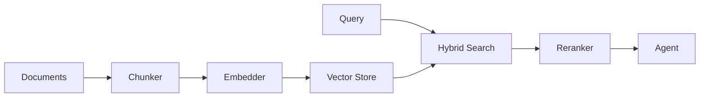

# RAG System

**Import:** `from selectools.rag import RAGAgent, DocumentLoader, VectorStore, TextSplitter`
**Stability:** <span class="badge-stable">stable</span>
**Since:** v0.14.0

```python title="rag_basic.py"
from selectools import Agent, AgentConfig, tool
from selectools.providers.stubs import LocalProvider
from selectools.rag import DocumentLoader, TextSplitter

# Load and chunk documents
docs = DocumentLoader.from_text(
    "Selectools supports OpenAI, Anthropic, Gemini, and Ollama providers. "
    "It provides RAG, tool calling, guardrails, and multi-agent orchestration.",
    metadata={"source": "overview.txt"},
)
splitter = TextSplitter(chunk_size=500, chunk_overlap=50)
chunks = splitter.split_documents(docs)
print(f"Loaded {len(chunks)} chunks from {len(docs)} documents")

# In production, embed chunks into a VectorStore and use RAGAgent:
# store = VectorStore.create("memory", embedder=embedder)
# store.add_documents(chunks)
# agent = RAGAgent.from_documents(docs, provider=provider, vector_store=store)
```



!!! tip "See Also"
    - [Embeddings](EMBEDDINGS.md) -- OpenAI, Anthropic, Gemini, Cohere embedding providers
    - [Vector Stores](VECTOR_STORES.md) -- Memory, SQLite, Chroma, Pinecone backends
    - [Advanced Chunking](ADVANCED_CHUNKING.md) -- semantic and contextual chunking
    - [Hybrid Search](HYBRID_SEARCH.md) -- BM25 + vector fusion with reranking

---

**Directory:** `src/selectools/rag/`
**Files:** `__init__.py`, `vector_store.py`, `loaders.py`, `chunking.py`, `tools.py`

## Table of Contents

1. [Overview](#overview)
2. [RAG Pipeline](#rag-pipeline)
3. [Document Loading](#document-loading)
4. [Text Chunking](#text-chunking)
5. [Vector Storage](#vector-storage)
6. [RAG Tools](#rag-tools)
7. [RAGAgent High-Level API](#ragagent-high-level-api)
8. [Cost Tracking](#cost-tracking)

---

## Overview

The **RAG (Retrieval-Augmented Generation)** system enables agents to answer questions about your documents by:

1. Loading documents from various sources
2. Chunking them into manageable pieces
3. Generating vector embeddings
4. Storing in a vector database
5. Retrieving relevant chunks during queries
6. Providing context to the LLM

### Key Components

```
DocumentLoader → TextSplitter → EmbeddingProvider → VectorStore → RAGTool → Agent
```

---

## RAG Pipeline

### Complete Flow Diagram

```
┌─────────────────────────────────────────────────────────────────┐
│ STAGE 1: DOCUMENT INGESTION                                    │
├─────────────────────────────────────────────────────────────────┤
│                                                                 │
│  Documents (Files/PDFs/Text)                                    │
│          │                                                      │
│          ▼                                                      │
│  ┌──────────────────┐                                          │
│  │ DocumentLoader   │                                          │
│  │ • from_file()    │                                          │
│  │ • from_directory()│                                          │
│  │ • from_pdf()     │                                          │
│  └────────┬─────────┘                                          │
│           │                                                      │
│           ▼                                                      │
│  [Document, Document, ...]                                      │
└─────────────────────────────────────────────────────────────────┘
           │
           ▼
┌─────────────────────────────────────────────────────────────────┐
│ STAGE 2: CHUNKING                                              │
├─────────────────────────────────────────────────────────────────┤
│                                                                 │
│  ┌──────────────────────────────────┐                          │
│  │ TextSplitter / RecursiveTextSplitter │                      │
│  │ • chunk_size=1000                 │                          │
│  │ • chunk_overlap=200              │                          │
│  │ • Respect boundaries             │                          │
│  └────────┬─────────────────────────┘                          │
│           │                                                      │
│           ▼                                                      │
│  [Chunk1, Chunk2, Chunk3, ...]                                  │
│  (with metadata: source, page, chunk_index)                     │
└─────────────────────────────────────────────────────────────────┘
           │
           ▼
┌─────────────────────────────────────────────────────────────────┐
│ STAGE 3: EMBEDDING                                             │
├─────────────────────────────────────────────────────────────────┤
│                                                                 │
│  ┌──────────────────────────────────┐                          │
│  │ EmbeddingProvider                │                          │
│  │ • OpenAI / Anthropic / Gemini   │                          │
│  │ • embed_texts(chunks)            │                          │
│  └────────┬─────────────────────────┘                          │
│           │                                                      │
│           ▼                                                      │
│  [[0.1, 0.2, ...], [0.3, 0.4, ...], ...]                       │
│  (vector embeddings)                                            │
└─────────────────────────────────────────────────────────────────┘
           │
           ▼
┌─────────────────────────────────────────────────────────────────┐
│ STAGE 4: STORAGE                                               │
├─────────────────────────────────────────────────────────────────┤
│                                                                 │
│  ┌──────────────────────────────────┐                          │
│  │ VectorStore                      │                          │
│  │ • Memory / SQLite / Chroma       │                          │
│  │ • add_documents(chunks, embeddings)│                        │
│  └──────────────────────────────────┘                          │
│           │                                                      │
│           ▼                                                      │
│  Vector Database                                                │
│  [chunk_id → (embedding, text, metadata)]                      │
└─────────────────────────────────────────────────────────────────┘
           │
           ▼
┌─────────────────────────────────────────────────────────────────┐
│ STAGE 5: QUERY & RETRIEVAL                                     │
├─────────────────────────────────────────────────────────────────┤
│                                                                 │
│  User Question: "What are the main features?"                   │
│           │                                                      │
│           ▼                                                      │
│  ┌──────────────────────────────────┐                          │
│  │ EmbeddingProvider.embed_query()  │                          │
│  └────────┬─────────────────────────┘                          │
│           │                                                      │
│           ▼                                                      │
│  Query Embedding: [0.5, 0.6, ...]                              │
│           │                                                      │
│           ▼                                                      │
│  ┌──────────────────────────────────┐                          │
│  │ VectorStore.search()             │                          │
│  │ • Cosine similarity              │                          │
│  │ • top_k=3                        │                          │
│  └────────┬─────────────────────────┘                          │
│           │                                                      │
│           ▼                                                      │
│  [SearchResult(doc, score), ...]                                │
│  Top 3 most similar chunks                                      │
└─────────────────────────────────────────────────────────────────┘
           │
           ▼
┌─────────────────────────────────────────────────────────────────┐
│ STAGE 6: GENERATION                                            │
├─────────────────────────────────────────────────────────────────┤
│                                                                 │
│  RAGTool formats results:                                       │
│  ┌─────────────────────────────────────────────────────────┐  │
│  │ [Source 1: file.txt, Relevance: 0.89]                   │  │
│  │ Main features include...                                 │  │
│  │                                                           │  │
│  │ [Source 2: docs.pdf (page 3), Relevance: 0.85]          │  │
│  │ Additional features are...                               │  │
│  └─────────────────────────────────────────────────────────┘  │
│           │                                                      │
│           ▼                                                      │
│  Agent receives context                                         │
│  LLM generates answer using retrieved information               │
│           │                                                      │
│           ▼                                                      │
│  Final Response with citations                                  │
└─────────────────────────────────────────────────────────────────┘
```

---

## Document Loading

### DocumentLoader Class

```python
from selectools.rag import DocumentLoader

# From text
docs = DocumentLoader.from_text("Hello world", metadata={"source": "memory"})

# From file
docs = DocumentLoader.from_file("document.txt")

# From directory
docs = DocumentLoader.from_directory(
    directory="./docs",
    glob_pattern="**/*.md",
    recursive=True
)

# From PDF
docs = DocumentLoader.from_pdf("manual.pdf")
```

### Document Structure

```python
@dataclass
class Document:
    text: str                    # Document content
    metadata: Dict[str, Any]     # Source, page, etc.
    embedding: Optional[List[float]] = None  # Pre-computed embedding
```

### Metadata

Automatically added:

- `source`: File path
- `filename`: File name only
- `page`: Page number (PDFs)
- `total_pages`: Total pages (PDFs)

---

## Text Chunking

### Why Chunk?

Large documents must be split because:

1. Embedding models have token limits
2. Retrieving entire documents is inefficient
3. Smaller chunks improve retrieval precision

### TextSplitter

```python
from selectools.rag import TextSplitter

splitter = TextSplitter(
    chunk_size=1000,       # Max characters per chunk
    chunk_overlap=200,     # Overlap for context continuity
    separator="\n\n"       # Prefer splitting on paragraphs
)

chunks = splitter.split_text(long_text)
chunked_docs = splitter.split_documents(documents)
```

### RecursiveTextSplitter

More intelligent splitting that respects natural boundaries:

```python
from selectools.rag import RecursiveTextSplitter

splitter = RecursiveTextSplitter(
    chunk_size=1000,
    chunk_overlap=200,
    separators=["\n\n", "\n", ". ", " ", ""]  # Try in order
)

# Tries to split on:
# 1. Double newlines (paragraphs) - preferred
# 2. Single newlines (lines)
# 3. Sentences (". ")
# 4. Words (" ")
# 5. Characters - last resort
```

### Chunk Metadata

```python
{
    "source": "docs/guide.md",
    "filename": "guide.md",
    "chunk": 0,           # Chunk index
    "total_chunks": 5     # Total chunks from this doc
}
```

### Advanced Chunking

For semantic (topic-boundary) splitting and LLM-context enrichment, see [Advanced Chunking](ADVANCED_CHUNKING.md).

---

## Vector Storage

### VectorStore Factory

```python
from selectools.rag import VectorStore
from selectools.embeddings import OpenAIEmbeddingProvider

embedder = OpenAIEmbeddingProvider()

# In-memory (fast, not persistent)
store = VectorStore.create("memory", embedder=embedder)

# SQLite (persistent, local)
store = VectorStore.create("sqlite", embedder=embedder, db_path="docs.db")

# Chroma (advanced features)
store = VectorStore.create("chroma", embedder=embedder, persist_directory="./chroma")

# Pinecone (cloud-hosted, scalable)
store = VectorStore.create("pinecone", embedder=embedder, index_name="my-index")
```

### Interface

```python
class VectorStore(ABC):
    @abstractmethod
    def add_documents(
        self,
        documents: List[Document],
        embeddings: Optional[List[List[float]]] = None
    ) -> List[str]:
        """Add documents, return IDs."""
        pass

    @abstractmethod
    def search(
        self,
        query_embedding: List[float],
        top_k: int = 5,
        filter: Optional[Dict[str, Any]] = None
    ) -> List[SearchResult]:
        """Search for similar documents."""
        pass

    @abstractmethod
    def delete(self, ids: List[str]) -> None:
        """Delete documents by ID."""
        pass

    @abstractmethod
    def clear(self) -> None:
        """Clear all documents."""
        pass
```

### Usage

```python
# Add documents
ids = store.add_documents(chunked_docs)
# Embeddings are generated automatically

# Search
query_embedding = embedder.embed_query("What are the features?")
results = store.search(query_embedding, top_k=3)

for result in results:
    print(f"Score: {result.score}")
    print(f"Text: {result.document.text}")
    print(f"Source: {result.document.metadata['source']}")
```

---

## RAG Tools

### RAGTool

Pre-built tool for knowledge base search:

```python
from selectools.rag import RAGTool

rag_tool = RAGTool(
    vector_store=store,
    top_k=3,                  # Retrieve top 3 chunks
    score_threshold=0.5,      # Minimum similarity
    include_scores=True       # Show relevance scores
)

# Use with agent
from selectools import Agent

agent = Agent(
    tools=[rag_tool.search_knowledge_base],
    provider=provider
)

response = agent.run([
    Message(role=Role.USER, content="What are the installation steps?")
])
```

### Tool Output Format

```
[Source 1: README.md, Relevance: 0.89]
Installation is simple:
1. pip install selectools
2. Set OPENAI_API_KEY
3. Create an agent

[Source 2: docs/quickstart.md (page 1), Relevance: 0.82]
Quick start guide:
First, install the package...

[Source 3: docs/setup.md, Relevance: 0.75]
Setup instructions for production...
```

The LLM uses this context to generate an accurate answer.

---

## RAGAgent High-Level API

### Three Convenient Methods

```python
from selectools.rag import RAGAgent

# 1. From documents
docs = DocumentLoader.from_file("doc.txt")
agent = RAGAgent.from_documents(
    documents=docs,
    provider=OpenAIProvider(),
    vector_store=store
)

# 2. From directory (most common)
agent = RAGAgent.from_directory(
    directory="./docs",
    provider=OpenAIProvider(),
    vector_store=store,
    glob_pattern="**/*.md",
    chunk_size=1000,
    top_k=3
)

# 3. From specific files
agent = RAGAgent.from_files(
    file_paths=["doc1.txt", "doc2.pdf"],
    provider=OpenAIProvider(),
    vector_store=store
)
```

### Behind the Scenes

`RAGAgent` automatically:

1. Loads documents
2. Chunks them
3. Generates embeddings
4. Stores in vector database
5. Creates RAGTool
6. Returns configured Agent

### Usage

```python
# Ask questions
response = agent.run("What are the main features?")
print(response.content)

# Check costs (includes embeddings)
print(agent.get_usage_summary())

# Continue conversation
response = agent.run("Tell me more about feature X")
```

---

## Cost Tracking

### RAG Costs

RAG operations incur two types of costs:

1. **Embedding Costs**: Generating vectors from text
2. **LLM Costs**: Generating responses

### Tracked Automatically

```python
agent = RAGAgent.from_directory("./docs", provider, store)

response = agent.run("What are the features?")

print(agent.usage)
```

### Output

```
============================================================
📊 Usage Summary
============================================================
Total Tokens: 5,432
  - Prompt: 3,210
  - Completion: 1,200
  - Embeddings: 1,022
Total Cost: $0.002150
  - LLM: $0.002000
  - Embeddings: $0.000150
============================================================
```

### Cost Breakdown

```python
# Embedding cost (one-time, during indexing)
embedding_cost = (num_chunks * avg_chunk_tokens / 1M) * embedding_model_cost

# Per-query cost
query_cost = (
    (query_tokens / 1M) * embedding_model_cost +  # Query embedding
    (prompt_tokens / 1M) * llm_prompt_cost +      # LLM prompt
    (completion_tokens / 1M) * llm_completion_cost # LLM completion
)
```

---

## Best Practices

### 1. Choose Appropriate Chunk Size

```python
# Short, focused documents
chunk_size=500

# Standard documents
chunk_size=1000

# Technical documentation
chunk_size=1500
```

### 2. Use Overlap for Context

```python
# Recommended overlap: 10-20% of chunk_size
splitter = TextSplitter(
    chunk_size=1000,
    chunk_overlap=200  # 20%
)
```

### 3. Set Reasonable top_k

```python
# Simple queries
top_k=1

# Standard queries
top_k=3

# Complex queries
top_k=5
```

### 4. Use Score Thresholds

```python
rag_tool = RAGTool(
    vector_store=store,
    top_k=3,
    score_threshold=0.7  # Filter low-relevance results
)
```

### 5. Choose Right Vector Store

```python
# Prototyping
store = VectorStore.create("memory", embedder)

# Production (local)
store = VectorStore.create("sqlite", embedder, db_path="prod.db")

# Production (scale)
store = VectorStore.create("pinecone", embedder, index_name="prod")
```

### 6. Use Free Embeddings

```python
from selectools.embeddings import GeminiEmbeddingProvider

# Gemini embeddings are FREE
embedder = GeminiEmbeddingProvider()
store = VectorStore.create("sqlite", embedder=embedder)
```

---

## Complete Example

```python
from selectools import OpenAIProvider, Message, Role
from selectools.embeddings import OpenAIEmbeddingProvider
from selectools.rag import RAGAgent, VectorStore
from selectools.models import OpenAI

# 1. Set up embedding provider
embedder = OpenAIEmbeddingProvider(
    model=OpenAI.Embeddings.TEXT_EMBEDDING_3_SMALL.id
)

# 2. Create vector store
store = VectorStore.create("sqlite", embedder=embedder, db_path="knowledge.db")

# 3. Create RAG agent from documents
agent = RAGAgent.from_directory(
    directory="./docs",
    glob_pattern="**/*.md",
    provider=OpenAIProvider(default_model=OpenAI.GPT_4O_MINI.id),
    vector_store=store,
    chunk_size=1000,
    chunk_overlap=200,
    top_k=3,
    score_threshold=0.5
)

# 4. Ask questions
questions = [
    "What are the installation steps?",
    "How do I create an agent?",
    "What providers are supported?"
]

for question in questions:
    print(f"\nQ: {question}")
    response = agent.run([Message(role=Role.USER, content=question)])
    print(f"A: {response.content}\n")

# 5. Check costs
print("=" * 60)
print(agent.get_usage_summary())
```

---

## Troubleshooting

### No Results Found

```python
# Issue: score_threshold too high
rag_tool = RAGTool(score_threshold=0.9)  # Too strict

# Fix: Lower threshold
rag_tool = RAGTool(score_threshold=0.5)
```

### Irrelevant Results

```python
# Issue: chunk_size too large
splitter = TextSplitter(chunk_size=5000)  # Too big

# Fix: Smaller chunks
splitter = TextSplitter(chunk_size=1000)
```

### High Costs

```python
# Issue: Expensive embedding model
embedder = OpenAIEmbeddingProvider(model="text-embedding-3-large")

# Fix: Use cheaper or free model
embedder = GeminiEmbeddingProvider()  # FREE
```

---

## Related Examples

| # | Script | Description |
|---|--------|-------------|
| 14 | [`14_rag_basic.py`](https://github.com/johnnichev/selectools/blob/main/examples/14_rag_basic.py) | Basic RAG pipeline with document loading |
| 15 | [`15_semantic_search.py`](https://github.com/johnnichev/selectools/blob/main/examples/15_semantic_search.py) | Semantic search over embedded documents |
| 16 | [`16_rag_advanced.py`](https://github.com/johnnichev/selectools/blob/main/examples/16_rag_advanced.py) | Advanced RAG with chunking and score thresholds |
| 18 | [`18_hybrid_search.py`](https://github.com/johnnichev/selectools/blob/main/examples/18_hybrid_search.py) | BM25 + vector hybrid search with reranking |
| 19 | [`19_advanced_chunking.py`](https://github.com/johnnichev/selectools/blob/main/examples/19_advanced_chunking.py) | Semantic and contextual chunking strategies |

---

## Further Reading

- [Advanced Chunking](ADVANCED_CHUNKING.md) - SemanticChunker and ContextualChunker
- [Embeddings Module](EMBEDDINGS.md) - Embedding providers
- [Vector Stores Module](VECTOR_STORES.md) - Storage implementations
- [Usage Module](USAGE.md) - Cost tracking

---

**Next Steps:** Understand embedding providers in the [Embeddings Module](EMBEDDINGS.md).
