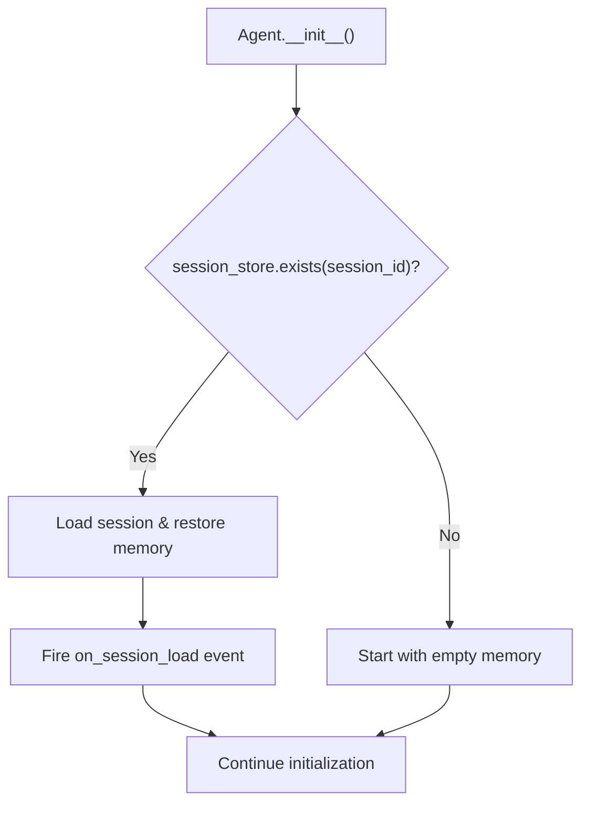
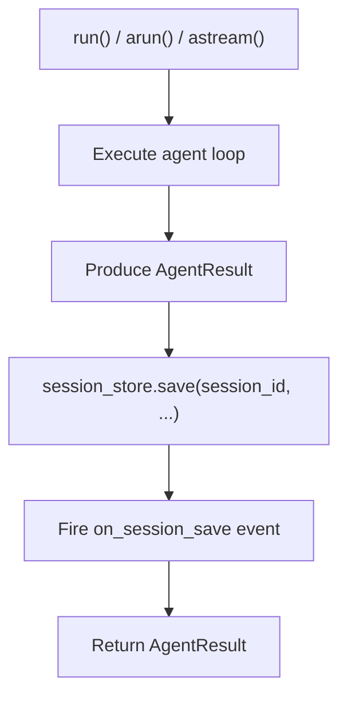
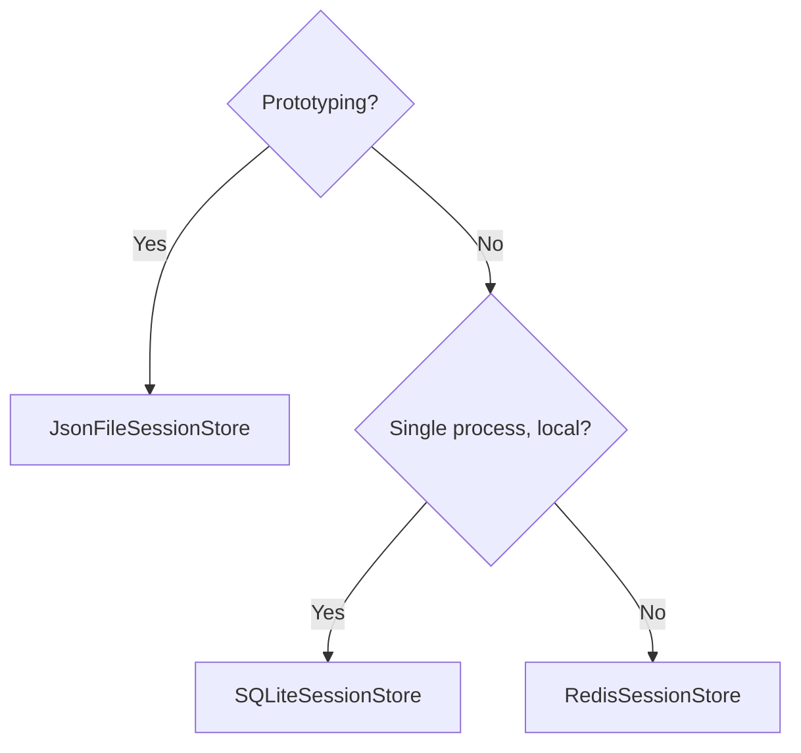

# Sessions Module

**Added in:** v0.16.0
**File:** `src/selectools/sessions.py`
**Classes:** `SessionStore`, `JsonFileSessionStore`, `SQLiteSessionStore`, `RedisSessionStore`

## Table of Contents

1. [Overview](#overview)
2. [Quick Start](#quick-start)
3. [SessionStore Protocol](#sessionstore-protocol)
4. [Store Backends](#store-backends)
5. [TTL-Based Expiry](#ttl-based-expiry)
6. [Agent Integration](#agent-integration)
7. [Observer Events](#observer-events)
8. [Choosing a Backend](#choosing-a-backend)
9. [Best Practices](#best-practices)

---

## Overview

The **Sessions** module provides persistent session storage for selectools agents. It saves and restores full conversation state -- memory, metadata, and configuration -- across process restarts, enabling long-running and resumable agent workflows.

### Purpose

- **Persistence**: Save agent state to disk, SQLite, or Redis between runs
- **Resumability**: Reload a previous session by ID and continue where you left off
- **Multi-User**: Maintain separate sessions per user, thread, or workflow
- **TTL Expiry**: Automatically expire stale sessions after a configurable duration
- **Auto-Save**: Transparent save after every `run()` / `arun()` call

---

## Quick Start

```python
from selectools import Agent, AgentConfig, OpenAIProvider, ConversationMemory, Message, Role
from selectools.sessions import JsonFileSessionStore

# Create a file-backed session store
session_store = JsonFileSessionStore(directory="./sessions")

# Configure agent with session support
agent = Agent(
    tools=[],
    provider=OpenAIProvider(),
    memory=ConversationMemory(max_messages=50),
    config=AgentConfig(
        session_store=session_store,
        session_id="user-alice-001",
    ),
)

# First run -- conversation is auto-saved after completion
result = agent.run([Message(role=Role.USER, content="My name is Alice.")])

# Later (even after restart) -- session auto-loads on init
agent2 = Agent(
    tools=[],
    provider=OpenAIProvider(),
    memory=ConversationMemory(max_messages=50),
    config=AgentConfig(
        session_store=session_store,
        session_id="user-alice-001",  # same ID resumes session
    ),
)

result = agent2.run([Message(role=Role.USER, content="What is my name?")])
# Agent remembers: "Alice"
```

---

## SessionStore Protocol

All backends implement the `SessionStore` protocol:

```python
from typing import Protocol, Optional, List, Dict, Any

class SessionStore(Protocol):
    def save(self, session_id: str, data: Dict[str, Any]) -> None:
        """Persist session data under the given ID."""
        ...

    def load(self, session_id: str) -> Optional[Dict[str, Any]]:
        """Load session data by ID. Returns None if not found or expired."""
        ...

    def exists(self, session_id: str) -> bool:
        """Check whether a session exists and has not expired."""
        ...

    def delete(self, session_id: str) -> None:
        """Delete a session by ID. No-op if it does not exist."""
        ...

    def list_sessions(self) -> List[str]:
        """Return all non-expired session IDs."""
        ...
```

### Session Data Format

The agent serializes the following into session data:

```python
{
    "session_id": "user-alice-001",
    "messages": [                        # ConversationMemory contents
        {"role": "user", "content": "My name is Alice."},
        {"role": "assistant", "content": "Hello Alice!"},
    ],
    "metadata": {                        # Arbitrary user-defined metadata
        "user_id": "alice",
        "started_at": "2026-03-13T10:00:00Z",
    },
    "created_at": "2026-03-13T10:00:00Z",
    "updated_at": "2026-03-13T10:05:00Z",
}
```

---

## Store Backends

### 1. JsonFileSessionStore

**Best for:** Local development, prototyping, single-instance deployments

Each session is stored as a separate JSON file:

```python
from selectools.sessions import JsonFileSessionStore

store = JsonFileSessionStore(
    directory="./sessions",    # directory for session files
    ttl_seconds=86400,         # expire after 24 hours (optional)
)

# Files created: ./sessions/user-alice-001.json
```

**Features:**

- No external dependencies
- Human-readable JSON files
- One file per session
- Atomic writes (write-to-temp then rename)

### 2. SQLiteSessionStore

**Best for:** Production single-instance, embedded applications

All sessions stored in a single SQLite database:

```python
from selectools.sessions import SQLiteSessionStore

store = SQLiteSessionStore(
    db_path="./sessions.db",   # SQLite database path
    ttl_seconds=604800,        # expire after 7 days (optional)
)
```

**Schema:**

```sql
CREATE TABLE sessions (
    session_id TEXT PRIMARY KEY,
    data TEXT NOT NULL,         -- JSON-serialized session
    created_at TEXT NOT NULL,   -- ISO 8601 timestamp
    updated_at TEXT NOT NULL    -- ISO 8601 timestamp
);
```

**Features:**

- Single-file persistence
- ACID transactions
- Efficient listing and lookup
- No external dependencies

### 3. RedisSessionStore

**Best for:** Multi-instance production, shared state across processes

```python
from selectools.sessions import RedisSessionStore

store = RedisSessionStore(
    url="redis://localhost:6379/0",  # Redis connection URL
    prefix="selectools:session:",    # key prefix (default)
    ttl_seconds=3600,                # expire after 1 hour (optional)
)
```

**Features:**

- Shared across processes and machines
- Native TTL support via Redis EXPIRE
- High throughput
- Requires running Redis instance

**Installation:**

```bash
pip install selectools[redis]  # Includes redis-py
```

---

## TTL-Based Expiry

All backends support optional time-to-live. When `ttl_seconds` is set, sessions that have not been updated within the TTL window are treated as expired.

```python
# Session expires 1 hour after last update
store = JsonFileSessionStore(directory="./sessions", ttl_seconds=3600)

store.save("s1", {"messages": []})

# Within 1 hour:
store.load("s1")      # Returns session data
store.exists("s1")     # True

# After 1 hour with no update:
store.load("s1")      # Returns None
store.exists("s1")     # False
store.list_sessions()  # Does not include "s1"
```

**Behavior by backend:**

| Backend | TTL Mechanism |
|---|---|
| `JsonFileSessionStore` | Checks `updated_at` in file on load |
| `SQLiteSessionStore` | Filters by `updated_at` column on queries |
| `RedisSessionStore` | Uses native Redis `EXPIRE` command |

Each `save()` call resets the TTL clock by updating the `updated_at` timestamp.

---

## Agent Integration

### Configuration

Pass a `SessionStore` and `session_id` via `AgentConfig`:

```python
from selectools import Agent, AgentConfig, OpenAIProvider, ConversationMemory
from selectools.sessions import SQLiteSessionStore

store = SQLiteSessionStore(db_path="sessions.db")

agent = Agent(
    tools=[...],
    provider=OpenAIProvider(),
    memory=ConversationMemory(max_messages=50),
    config=AgentConfig(
        session_store=store,
        session_id="thread-abc-123",
    ),
)
```

### Auto-Load on Init

When both `session_store` and `session_id` are set, the agent attempts to load the session during initialization:



### Auto-Save After Run

After each `run()`, `arun()`, or `astream()` completes, the agent saves the current state:



### Session Metadata

Attach arbitrary metadata to sessions:

```python
agent = Agent(
    tools=[...],
    provider=OpenAIProvider(),
    memory=ConversationMemory(),
    config=AgentConfig(
        session_store=store,
        session_id="user-42",
        session_metadata={
            "user_id": "42",
            "channel": "web",
            "created_at": "2026-03-13T10:00:00Z",
        },
    ),
)
```

Metadata is persisted alongside messages and restored on load.

---

## Observer Events

Two new observer events are fired for session lifecycle:

```python
from selectools import AgentObserver

class SessionWatcher(AgentObserver):
    def on_session_load(self, run_id: str, session_id: str, message_count: int) -> None:
        print(f"[{run_id}] Loaded session '{session_id}' with {message_count} messages")

    def on_session_save(self, run_id: str, session_id: str, message_count: int) -> None:
        print(f"[{run_id}] Saved session '{session_id}' with {message_count} messages")
```

| Event | When | Parameters |
|---|---|---|
| `on_session_load` | After restoring a session during init | `run_id`, `session_id`, `message_count` |
| `on_session_save` | After persisting session state post-run | `run_id`, `session_id`, `message_count` |

---

## Choosing a Backend

### Decision Matrix

| Feature | JsonFile | SQLite | Redis |
|---|---|---|---|
| **Dependencies** | None | None | `redis` |
| **Persistence** | File per session | Single DB file | Remote server |
| **Multi-process** | No (file locks) | Limited | Yes |
| **TTL** | Application-level | Application-level | Native |
| **Scalability** | Thousands | Tens of thousands | Millions |
| **Setup** | Directory path | DB path | Redis URL |

### Recommendation Flow



---

## Best Practices

### 1. Use Meaningful Session IDs

```python
# Good -- traceable, unique per conversation
session_id = f"user-{user_id}-{conversation_id}"

# Bad -- opaque, hard to debug
session_id = str(uuid.uuid4())
```

### 2. Set TTL for Production

```python
# Expire idle sessions after 7 days
store = SQLiteSessionStore(db_path="sessions.db", ttl_seconds=604800)
```

### 3. Handle Missing Sessions Gracefully

```python
data = store.load("nonexistent-session")
if data is None:
    # Start fresh -- agent does this automatically
    pass
```

### 4. List and Clean Up Sessions

```python
# List all active sessions
for sid in store.list_sessions():
    print(sid)

# Delete a specific session
store.delete("user-alice-001")
```

### 5. Separate Stores by Environment

```python
if ENV == "development":
    store = JsonFileSessionStore(directory="./dev-sessions")
elif ENV == "production":
    store = RedisSessionStore(url=REDIS_URL, ttl_seconds=86400)
```

---

## Testing

```python
def test_session_roundtrip():
    store = JsonFileSessionStore(directory="/tmp/test-sessions")

    store.save("s1", {
        "messages": [{"role": "user", "content": "Hello"}],
        "metadata": {"user": "test"},
    })

    assert store.exists("s1")
    data = store.load("s1")
    assert data is not None
    assert len(data["messages"]) == 1
    assert data["messages"][0]["content"] == "Hello"

    store.delete("s1")
    assert not store.exists("s1")


def test_session_ttl_expiry():
    store = JsonFileSessionStore(
        directory="/tmp/test-sessions",
        ttl_seconds=1,  # 1-second TTL for testing
    )

    store.save("s1", {"messages": []})
    assert store.exists("s1")

    import time
    time.sleep(2)

    assert not store.exists("s1")
    assert store.load("s1") is None


def test_agent_with_sessions():
    store = JsonFileSessionStore(directory="/tmp/test-sessions")
    memory = ConversationMemory(max_messages=20)

    agent = Agent(
        tools=[],
        provider=LocalProvider(),
        memory=memory,
        config=AgentConfig(
            session_store=store,
            session_id="test-session",
        ),
    )

    agent.run([Message(role=Role.USER, content="Hello")])
    assert store.exists("test-session")

    # New agent with same session ID loads history
    agent2 = Agent(
        tools=[],
        provider=LocalProvider(),
        memory=ConversationMemory(max_messages=20),
        config=AgentConfig(
            session_store=store,
            session_id="test-session",
        ),
    )

    history = agent2.memory.get_history()
    assert len(history) > 0
```

---

## API Reference

| Class | Description |
|---|---|
| `SessionStore` | Protocol defining save/load/list/delete/exists interface |
| `JsonFileSessionStore(directory, ttl_seconds)` | File-based backend, one JSON file per session |
| `SQLiteSessionStore(db_path, ttl_seconds)` | SQLite-backed backend, single database file |
| `RedisSessionStore(url, prefix, ttl_seconds)` | Redis-backed backend for distributed deployments |

| AgentConfig Field | Type | Description |
|---|---|---|
| `session_store` | `Optional[SessionStore]` | Backend for session persistence |
| `session_id` | `Optional[str]` | ID to save/load this session |
| `session_metadata` | `Optional[Dict[str, Any]]` | Arbitrary metadata stored with the session |

---

## Further Reading

- [Memory Module](MEMORY.md) - Conversation memory that sessions persist
- [Agent Module](AGENT.md) - How agents integrate with session storage
- [Entity Memory Module](ENTITY_MEMORY.md) - Entity tracking across sessions
- [Knowledge Module](KNOWLEDGE.md) - Cross-session knowledge memory

---

**Next Steps:** Learn about entity tracking in the [Entity Memory Module](ENTITY_MEMORY.md).
