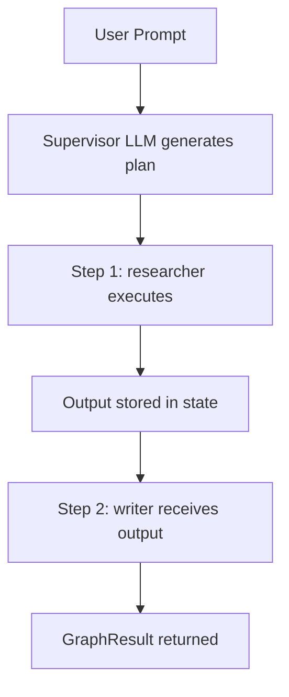

# SupervisorAgent Module

**Added in:** v0.18.0
**File:** `src/selectools/orchestration/supervisor.py`
**Classes:** `SupervisorAgent`, `SupervisorStrategy`, `ModelSplit`

## Table of Contents

1. [Overview](#overview)
2. [Quick Start](#quick-start)
3. [Strategies](#strategies)
   - [plan_and_execute](#plan_and_execute)
   - [round_robin](#round_robin)
   - [dynamic](#dynamic)
   - [magentic](#magentic)
4. [ModelSplit](#modelsplit)
5. [Delegation Constraints](#delegation-constraints)
6. [Budget & Cancellation](#budget-cancellation)
7. [Observers](#observers)
8. [Streaming](#streaming)
9. [GraphResult](#graphresult)
10. [Choosing a Strategy](#choosing-a-strategy)
11. [API Reference](#api-reference)
12. [Examples](#examples)

---

## Overview

**SupervisorAgent** is a high-level multi-agent coordinator that wraps [AgentGraph](ORCHESTRATION.md) to provide four structured coordination strategies. Instead of building a graph manually with nodes and edges, you hand the supervisor a dict of named agents and pick a strategy. The supervisor handles planning, routing, completion detection, and replanning internally.

### When to use SupervisorAgent vs raw AgentGraph

| Use case | Recommendation |
|---|---|
| "Run these 3 agents in a planned sequence" | SupervisorAgent (`plan_and_execute`) |
| "Let agents take turns collaborating" | SupervisorAgent (`round_robin`) |
| "Route to the best agent each step" | SupervisorAgent (`dynamic`) |
| "Fully autonomous multi-agent with replanning" | SupervisorAgent (`magentic`) |
| Custom graph topology (branches, parallel fan-out, HITL) | AgentGraph directly |
| Conditional routing with Python functions | AgentGraph directly |
| Subgraph composition | AgentGraph directly |

The supervisor builds an AgentGraph internally for each run -- you get the same execution engine, checkpointing, budget propagation, and observer events without writing graph wiring code.

---

## Quick Start

A minimal supervisor with two agents in under 20 lines:

```python
from selectools import Agent, SupervisorAgent, SupervisorStrategy
from selectools.providers import OpenAIProvider

provider = OpenAIProvider()

researcher = Agent(tools=[...], provider=provider, system_prompt="You are a researcher.")
writer = Agent(tools=[...], provider=provider, system_prompt="You are a writer.")

supervisor = SupervisorAgent(
    agents={"researcher": researcher, "writer": writer},
    provider=provider,
    strategy="plan_and_execute",
)

result = supervisor.run("Write a blog post about LLM safety")
print(result.content)
print(f"Total tokens: {result.total_usage.total_tokens}")
```

The supervisor asks the LLM to generate a JSON plan (`[{"agent": "researcher", "task": "..."}, {"agent": "writer", "task": "..."}]`), then executes each step sequentially, passing the output of one agent as context to the next.

---

## Strategies

### plan_and_execute

The supervisor LLM generates a structured JSON plan, then executes each step sequentially. This is the default strategy.

**Flow:**



**Usage:**

```python
supervisor = SupervisorAgent(
    agents={
        "researcher": researcher_agent,
        "writer": writer_agent,
        "reviewer": reviewer_agent,
    },
    provider=provider,
    strategy="plan_and_execute",
)

result = supervisor.run("Write a reviewed article about quantum computing")
# The LLM decides the order and task for each agent
```

If the supervisor LLM fails to produce valid JSON, the fallback behavior executes agents in registration order with the original prompt.

---

### round_robin

Agents take turns in registration order. After each full round (every agent has acted once), the supervisor checks whether the task looks complete. Runs up to `max_rounds` rounds.

**Flow:**

```
Round 1:
  agent_a acts --> agent_b acts --> agent_c acts
  Completion check: not done
Round 2:
  agent_a acts --> agent_b acts --> agent_c acts
  Completion check: done --> stop
```

**Usage:**

```python
supervisor = SupervisorAgent(
    agents={
        "brainstormer": brainstorm_agent,
        "critic": critic_agent,
        "refiner": refine_agent,
    },
    provider=provider,
    strategy="round_robin",
    max_rounds=3,
)

result = supervisor.run("Design a REST API for a todo app")
```

Completion is detected by heuristic -- if the last agent output contains signals like "task complete", "done.", or "finished.", the supervisor stops early.

---

### dynamic

An LLM router selects the best agent for each step based on the current task state and execution history. The router can respond with `"DONE"` to signal completion.

**Flow:**

```
Step 1:
  Router sees: "Task: analyze data, History: none"
  Router selects: "data_loader"
  data_loader executes

Step 2:
  Router sees: "Task: analyze data, History: data_loader loaded CSV"
  Router selects: "analyst"
  analyst executes

Step 3:
  Router sees: "Task: analyze data, History: analyst produced insights"
  Router responds: "DONE"
```

**Usage:**

```python
supervisor = SupervisorAgent(
    agents={
        "data_loader": loader_agent,
        "analyst": analyst_agent,
        "visualizer": viz_agent,
    },
    provider=provider,
    strategy="dynamic",
    max_rounds=8,
)

result = supervisor.run("Analyze sales data and create a summary")
```

If the router hallucinates an agent name that does not exist, the supervisor falls back to the first registered agent.

---

### magentic

The most autonomous strategy, based on the Magentic-One pattern. The supervisor maintains two ledgers:

1. **Task Ledger** -- known facts, working assumptions, and the current plan
2. **Progress Ledger** -- whether the task is progressing, whether it is complete, and which agent should act next

After `max_stalls` consecutive unproductive steps, the supervisor replans from scratch with a fresh approach.

**Flow:**

```
Step 1:
  Supervisor produces ledger:
    task_ledger: {facts: [...], plan: ["step 1", "step 2"]}
    progress_ledger: {is_complete: false, is_progressing: true, next_agent: "researcher"}
  researcher executes

Step 2:
  Supervisor updates ledger:
    progress_ledger: {is_complete: false, is_progressing: false, next_agent: "researcher"}
  Stall detected (1/2)

Step 3:
  Supervisor updates ledger:
    progress_ledger: {is_complete: false, is_progressing: false, next_agent: "researcher"}
  Stall detected (2/2) --> max_stalls reached --> REPLAN
  on_supervisor_replan event fires
  New plan generated from scratch

Step 4:
  Supervisor updates ledger with fresh plan:
    progress_ledger: {is_complete: false, is_progressing: true, next_agent: "writer"}
  writer executes

Step 5:
  progress_ledger: {is_complete: true, next_agent: "DONE"}
  --> stop
```

**Usage:**

```python
supervisor = SupervisorAgent(
    agents={
        "researcher": researcher_agent,
        "coder": coder_agent,
        "reviewer": reviewer_agent,
    },
    provider=provider,
    strategy="magentic",
    max_rounds=10,
    max_stalls=2,  # replan after 2 consecutive unproductive steps
)

result = supervisor.run("Build a Python CLI tool that fetches weather data")
print(f"Stalls detected: {result.stalls}")
```

---

## ModelSplit

Use separate models for planning and execution to reduce costs by 70-90%. The expensive model generates the plan; cheap models execute the steps.

```python
from selectools import SupervisorAgent, ModelSplit

supervisor = SupervisorAgent(
    agents={"researcher": researcher, "writer": writer},
    provider=provider,
    strategy="plan_and_execute",
    model_split=ModelSplit(
        planner_model="gpt-4o",        # expensive: generates the plan
        executor_model="gpt-4o-mini",   # cheap: executes each step
    ),
)

result = supervisor.run("Write a technical report")
print(f"Total cost: ${result.total_usage.cost_usd:.4f}")
```

`ModelSplit` is a dataclass with two fields:

| Field | Type | Description |
|-------|------|-------------|
| `planner_model` | `str` | Model used for supervisor planning and routing calls |
| `executor_model` | `str` | Model used by agent nodes during execution |

When `model_split` is `None` (the default), the supervisor uses a default lightweight model (`gpt-4o-mini` if available) for planning calls. The agent nodes use whatever model their individual `Agent` instances are configured with.

---

## Delegation Constraints

The `delegation_constraints` parameter prevents infinite delegation ping-pong between agents. It maps each agent name to an explicit allow-list of agents it can delegate to.

```python
supervisor = SupervisorAgent(
    agents={
        "planner": planner_agent,
        "worker_a": worker_a_agent,
        "worker_b": worker_b_agent,
    },
    provider=provider,
    strategy="dynamic",
    delegation_constraints={
        # worker_a can only hand off to planner (not to worker_b)
        "worker_a": ["planner"],
        # worker_b can only hand off to planner
        "worker_b": ["planner"],
        # planner can delegate to either worker
        "planner": ["worker_a", "worker_b"],
    },
)
```

Without constraints, dynamic and magentic strategies could produce cycles where two agents keep handing work back and forth. Constraints enforce a directed hierarchy.

---

## Budget & Cancellation

SupervisorAgent propagates budget limits and cancellation tokens to the underlying AgentGraph.

### Token and cost budgets

```python
supervisor = SupervisorAgent(
    agents={"researcher": researcher, "writer": writer},
    provider=provider,
    strategy="plan_and_execute",
    max_total_tokens=100_000,   # graph-level token budget
    max_cost_usd=0.50,          # graph-level cost cap
    max_rounds=10,              # iteration limit
)

result = supervisor.run("Write a detailed analysis")
print(f"Tokens used: {result.total_usage.total_tokens}")
```

When a budget limit is hit, the graph stops gracefully and returns a partial `GraphResult` with whatever work was completed.

### Cancellation

```python
import asyncio
from selectools import CancellationToken

token = CancellationToken()

supervisor = SupervisorAgent(
    agents={"worker": worker_agent},
    provider=provider,
    strategy="round_robin",
    cancellation_token=token,
)

async def run_with_timeout():
    task = asyncio.create_task(supervisor.arun("Long-running task"))
    await asyncio.sleep(5)
    token.cancel()  # cooperative cancellation
    result = await task
    print(f"Steps completed: {result.steps}")

asyncio.run(run_with_timeout())
```

The cancellation token is checked at the start of each round and before each agent call. Cancellation is cooperative -- the current agent call completes, but no new calls are started.

---

## Observers

Attach `AgentObserver` instances to receive events from the supervisor and its underlying graph.

### on_supervisor_replan

The `on_supervisor_replan` event fires when the magentic strategy replans from scratch after hitting `max_stalls`:

```python
from selectools import AgentObserver

class SupervisorWatcher(AgentObserver):
    def on_supervisor_replan(self, run_id: str, stall_count: int, new_plan: str):
        print(f"[{run_id}] Replanned after {stall_count} stalls")
        print(f"  New plan: {new_plan[:200]}")

supervisor = SupervisorAgent(
    agents={"researcher": researcher, "coder": coder},
    provider=provider,
    strategy="magentic",
    max_stalls=2,
    observers=[SupervisorWatcher()],
)
```

The `new_plan` parameter is the raw JSON string returned by the supervisor LLM during replanning.

### Graph-level observer events

Because the supervisor wraps AgentGraph, all standard graph observer events also fire: `on_graph_start`, `on_node_start`, `on_node_end`, `on_stall_detected`, `on_loop_detected`, and `on_budget_exceeded`.

---

## Streaming

Use `astream()` to receive graph events from the supervisor execution as they happen:

```python
import asyncio
from selectools import SupervisorAgent

supervisor = SupervisorAgent(
    agents={"researcher": researcher, "writer": writer},
    provider=provider,
    strategy="plan_and_execute",
)

async def stream_supervisor():
    async for event in supervisor.astream("Write a blog post"):
        print(f"Event: {event.type} | Node: {event.node_name}")
        if event.data:
            print(f"  Data: {str(event.data)[:100]}")

asyncio.run(stream_supervisor())
```

The `astream()` method builds a round-robin graph internally and yields `GraphEvent` objects with `type` (a `GraphEventType` enum) and `node_name` fields.

---

## GraphResult

All supervisor methods return a `GraphResult` dataclass:

| Field | Type | Description |
|-------|------|-------------|
| `content` | `str` | Last node's output (the final result) |
| `state` | `GraphState` | Final shared state after all nodes executed |
| `node_results` | `Dict[str, List[AgentResult]]` | Per-agent result lists keyed by agent name |
| `trace` | `AgentTrace` | Graph-level execution trace |
| `total_usage` | `UsageStats` | Aggregated token and cost stats across all agents |
| `interrupted` | `bool` | `True` if paused for human-in-the-loop |
| `interrupt_id` | `Optional[str]` | Checkpoint ID for `graph.resume()` |
| `steps` | `int` | Total graph-level iterations executed |
| `stalls` | `int` | Number of stall events detected |
| `loops_detected` | `int` | Number of hard loop events detected |

```python
result = supervisor.run("Analyze this dataset")

# Final content
print(result.content)

# Per-agent results
for agent_name, results in result.node_results.items():
    for r in results:
        print(f"  {agent_name}: {r.content[:80]}")

# Cost tracking
print(f"Total tokens: {result.total_usage.total_tokens}")
print(f"Total cost: ${result.total_usage.cost_usd:.4f}")

# Execution metadata
print(f"Steps: {result.steps}, Stalls: {result.stalls}")
```

---

## Choosing a Strategy

| Criteria | plan_and_execute | round_robin | dynamic | magentic |
|---|---|---|---|---|
| **Autonomy** | Low | Low | Medium | High |
| **Cost** | Lowest (with ModelSplit) | Medium | Medium | Highest |
| **Predictability** | High (fixed plan) | High (fixed order) | Medium | Low |
| **Handles stalls** | No | No | No | Yes (auto-replan) |
| **Best for** | Known workflows | Collaborative refinement | Heterogeneous agents | Open-ended tasks |
| **LLM calls overhead** | 1 (plan) | 0 | 1 per step (routing) | 1 per step (ledger) |

**Rules of thumb:**

- Start with **plan_and_execute** -- it is the simplest and cheapest, especially with `ModelSplit`.
- Use **round_robin** when every agent should contribute each round (brainstorm/critique/refine loops).
- Use **dynamic** when you have specialized agents and the optimal sequence depends on intermediate results.
- Use **magentic** for complex, open-ended tasks where the supervisor needs to detect dead ends and try a different approach.

---

## API Reference

### `SupervisorAgent.__init__()` Parameters

| Parameter | Type | Default | Description |
|---|---|---|---|
| `agents` | `Dict[str, Agent]` | (required) | Named agent instances. Keys are the names used in plans and routing. |
| `provider` | `Provider` | (required) | LLM provider for supervisor planning/routing calls. |
| `strategy` | `SupervisorStrategy` | `"plan_and_execute"` | Coordination strategy. Accepts enum or string. |
| `max_rounds` | `int` | `10` | Maximum coordination rounds before stopping. |
| `max_stalls` | `int` | `2` | Magentic only: consecutive unproductive steps before replanning. |
| `model_split` | `Optional[ModelSplit]` | `None` | Separate models for planning vs execution. |
| `delegation_constraints` | `Optional[Dict[str, List[str]]]` | `None` | Per-agent allow-lists to prevent delegation loops. |
| `cancellation_token` | `Optional[CancellationToken]` | `None` | Token for cooperative cancellation. |
| `max_total_tokens` | `Optional[int]` | `None` | Graph-level cumulative token budget. |
| `max_cost_usd` | `Optional[float]` | `None` | Graph-level cumulative cost cap in USD. |
| `observers` | `Optional[List[AgentObserver]]` | `None` | Observer instances for events. |

### Methods

| Method | Signature | Description |
|---|---|---|
| `run()` | `run(prompt: str) -> GraphResult` | Synchronous execution. |
| `arun()` | `async arun(prompt: str) -> GraphResult` | Asynchronous execution. |
| `astream()` | `async astream(prompt: str) -> AsyncGenerator[GraphEvent, None]` | Stream graph events. |

---

## Examples

See [examples/60_supervisor_agent.py](https://github.com/johnnichev/selectools/blob/main/examples/60_supervisor_agent.py) for a runnable demo of all four strategies using mock agents (no API keys needed).

---

## See Also

- [AgentGraph Module](ORCHESTRATION.md) -- low-level graph engine that SupervisorAgent wraps
- [Budget & Cost Limits](BUDGET.md) -- token and cost budget system
- [Orchestration Module](ORCHESTRATION.md) -- full graph engine reference
- [Agent Module](AGENT.md) -- individual agent configuration

---

**Next Steps:** Learn about building custom graphs in the [AgentGraph Module](ORCHESTRATION.md).
