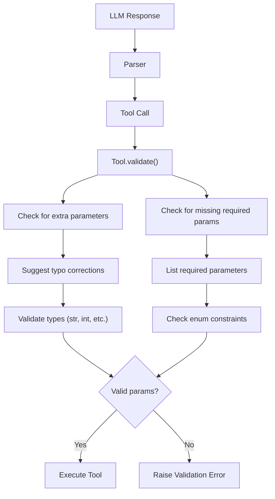
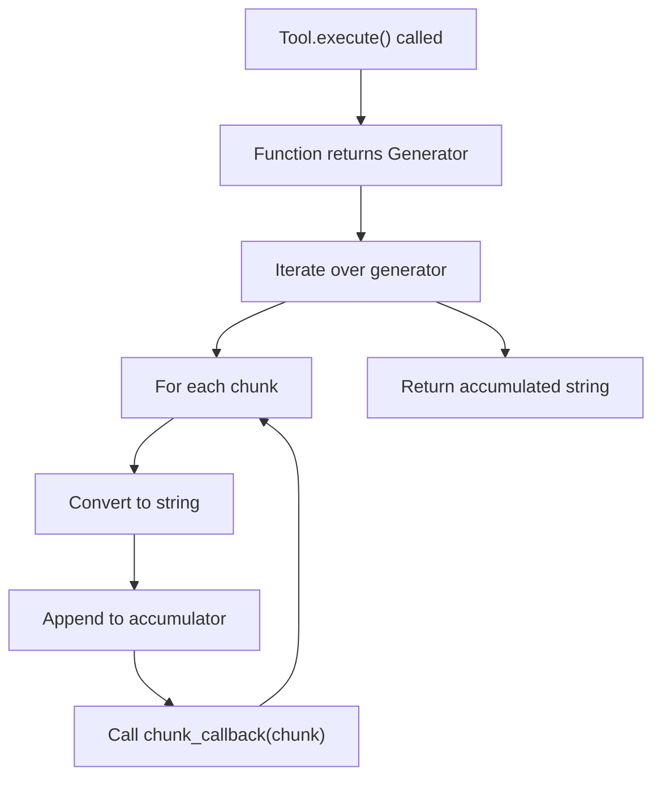

# Tools Module

**Import:** `from selectools import Tool, tool, ToolParameter, ToolRegistry`
**Stability:** <span class="badge-stable">stable</span>
**Since:** v0.13.0

```python title="tool_basics.py"
from selectools import Agent, AgentConfig, tool
from selectools.providers.stubs import LocalProvider

@tool()
def get_weather(location: str) -> str:
    """Get current weather for a city."""
    return f"Weather in {location}: 22C, sunny"

@tool()
def add(a: int, b: int) -> str:
    """Add two numbers together."""
    return str(a + b)

agent = Agent(
    tools=[get_weather, add],
    provider=LocalProvider(),
    config=AgentConfig(model="gpt-4o"),
)
result = agent.run("What is the weather in Paris?")
print(result.content)
```

!!! tip "See Also"
    - [Agent](AGENT.md) -- how agents use tools in the execution loop
    - [Dynamic Tools](DYNAMIC_TOOLS.md) -- ToolLoader, hot-reload, plugin systems
    - [Toolbox](TOOLBOX.md) -- 48 pre-built tools (file, web, data, datetime, text, code, search, and more)

---

**File:** `src/selectools/tools.py`
**Classes:** `Tool`, `ToolParameter`, `ToolRegistry`
**Decorators:** `@tool`

## Table of Contents

1. [Overview](#overview)
2. [Tool Definition](#tool-definition)
3. [Schema Generation](#schema-generation)
4. [Parameter Validation](#parameter-validation)
5. [Tool Execution](#tool-execution)
6. [Typed Results and Artifacts](#typed-results-and-artifacts)
7. [Decorator Pattern](#decorator-pattern)
8. [Tool Registry](#tool-registry)
9. [Streaming Tools](#streaming-tools)
10. [Injected Parameters](#injected-parameters)
11. [Type Hint Support](#type-hint-support)
12. [Implementation Details](#implementation-details)

---

## Overview

The **Tools** module provides the foundation for defining callable functions that AI agents can invoke. It handles:

- **Schema Generation**: Automatic JSON schema from Python type hints
- **Validation**: Runtime parameter checking with helpful errors
- **Execution**: Sync/async function calls with timeout support
- **Streaming**: Progressive results via Generator/AsyncGenerator
- **Injection**: Clean separation of LLM-visible and hidden parameters

### Core Classes

```python
ToolParameter   # Defines a single parameter
Tool            # Encapsulates a callable with metadata
ToolRegistry    # Organizes multiple tools
```

---

## Tool Definition

### Manual Definition

```python
from selectools import Tool, ToolParameter

def get_weather(location: str, units: str = "celsius") -> str:
    return f"Weather in {location}: 72°{units[0].upper()}"

weather_tool = Tool(
    name="get_weather",
    description="Get current weather for a location",
    parameters=[
        ToolParameter(
            name="location",
            param_type=str,
            description="City name or coordinates",
            required=True
        ),
        ToolParameter(
            name="units",
            param_type=str,
            description="celsius or fahrenheit",
            required=False,
            enum=["celsius", "fahrenheit"]
        ),
    ],
    function=get_weather
)
```

### Using @tool Decorator (Recommended)

```python
from selectools import tool

@tool(
    name="get_weather",  # Optional: defaults to function name
    description="Get current weather for a location",
    param_metadata={
        "location": {"description": "City name or coordinates"},
        "units": {"description": "Temperature units", "enum": ["celsius", "fahrenheit"]}
    }
)
def get_weather(location: str, units: str = "celsius") -> str:
    return f"Weather in {location}: 72°{units[0].upper()}"
```

The decorator accepts these keyword arguments:

- **`name`** (`str`, optional): Override the function name used as the tool name
- **`description`** (`str`, optional): Tool description (falls back to docstring)
- **`param_metadata`** (`dict`, optional): Per-parameter descriptions and enum constraints
- **`streaming`** (`bool`, default `False`): Mark tool as a streaming generator
- **`screen_output`** (`bool`, default `False`): Enable output screening for prompt injection
- **`terminal`** (`bool`, default `False`): Stop the agent loop after this tool executes

It also:

- Infers parameter names and types from function signature
- Detects required vs optional from default values
- Generates JSON schema automatically

---

## Schema Generation

### Type Mapping

Python types are mapped to JSON schema types:

```python
str    → "string"
int    → "integer"
float  → "number"
bool   → "boolean"
list   → "array"
dict   → "object"
```

### Generated Schema

For the `get_weather` tool:

```json
{
  "name": "get_weather",
  "description": "Get current weather for a location",
  "parameters": {
    "type": "object",
    "properties": {
      "location": {
        "type": "string",
        "description": "City name or coordinates"
      },
      "units": {
        "type": "string",
        "description": "Temperature units",
        "enum": ["celsius", "fahrenheit"]
      }
    },
    "required": ["location"]
  }
}
```

### Schema Usage

The agent sends this schema to the LLM in the system prompt:

```
Available tools (JSON schema):

{
  "name": "get_weather",
  "description": "Get current weather for a location",
  ...
}
```

The LLM uses this to understand:

- What tools are available
- What parameters each tool needs
- What values are valid
- Which parameters are required

---

## Parameter Validation

### Validation Flow



### Implementation

```python
def validate(self, params: Dict[str, ParameterValue]) -> None:
    expected_params = {p.name for p in self.parameters}
    provided_params = set(params.keys())
    extra_params = provided_params - expected_params

    # 1. Check for unexpected parameters
    if extra_params:
        suggestions = []
        for extra in extra_params:
            # Use difflib to find close matches
            matches = difflib.get_close_matches(extra, expected_params, n=1, cutoff=0.6)
            if matches:
                suggestions.append(f"'{extra}' -> Did you mean '{matches[0]}'?")
            else:
                suggestions.append(f"'{extra}' is not a valid parameter")

        raise ToolValidationError(
            tool_name=self.name,
            param_name=", ".join(sorted(extra_params)),
            issue="Unexpected parameter(s)",
            suggestion="; ".join(suggestions)
        )

    # 2. Check for missing required parameters
    for param in self.parameters:
        if param.required and param.name not in params:
            expected_list = ", ".join(f"'{p.name}'" for p in self.parameters if p.required)
            raise ToolValidationError(
                tool_name=self.name,
                param_name=param.name,
                issue="Missing required parameter",
                suggestion=f"Required parameters: {expected_list}"
            )

        if param.name not in params:
            continue

        # 3. Validate parameter type
        error = self._validate_single(param, params[param.name])
        if error:
            # Provide type conversion suggestions
            value = params[param.name]
            type_hint = ""
            if param.param_type is str and not isinstance(value, str):
                type_hint = f"Try: {param.name}=str({repr(value)})"
            elif param.param_type is int and isinstance(value, str):
                type_hint = f"Try: {param.name}=int('{value}')"

            raise ToolValidationError(
                tool_name=self.name,
                param_name=param.name,
                issue=error,
                suggestion=type_hint if type_hint else f"Expected type: {param.param_type.__name__}"
            )
```

### Error Messages

Validation errors are designed to be helpful:

```
============================================================
❌ Tool Validation Error: 'get_weather'
============================================================

Parameter: loction
Issue: Unexpected parameter(s)

💡 Suggestion: 'loction' -> Did you mean 'location'?
Expected parameters: 'location', 'units'

============================================================
```

The LLM sees this error and can correct its mistake in the next iteration.

---

## Tool Execution

### Sync Execution

```python
def execute(self, params: Dict[str, ParameterValue], chunk_callback=None) -> str:
    # 1. Validate parameters
    self.validate(params)

    # 2. Prepare arguments
    call_args = dict(params)
    call_args.update(self.injected_kwargs)
    if self.config_injector:
        call_args.update(self.config_injector() or {})

    # 3. Execute function
    try:
        result = self.function(**call_args)

        # 4. Handle streaming (generators)
        if inspect.isgenerator(result):
            chunks = []
            for chunk in result:
                chunk_str = str(chunk)
                chunks.append(chunk_str)
                if chunk_callback:
                    chunk_callback(chunk_str)
            return "".join(chunks)

        return str(result)

    except Exception as exc:
        raise ToolExecutionError(
            tool_name=self.name,
            error=exc,
            params=params
        ) from exc
```

### Async Execution

```python
async def aexecute(self, params, chunk_callback=None) -> str:
    self.validate(params)

    call_args = dict(params)
    call_args.update(self.injected_kwargs)
    if self.config_injector:
        call_args.update(self.config_injector() or {})

    try:
        if self.is_async:
            # Async function or async generator
            result = self.function(**call_args)

            if inspect.isasyncgen(result):
                # Async generator
                chunks = []
                async for chunk in result:
                    chunk_str = str(chunk)
                    chunks.append(chunk_str)
                    if chunk_callback:
                        chunk_callback(chunk_str)
                return "".join(chunks)

            # Regular async function
            result = await result
            return str(result)
        else:
            # Sync function - run in executor
            loop = asyncio.get_event_loop()
            with ThreadPoolExecutor() as executor:
                result = await loop.run_in_executor(
                    executor,
                    lambda: self.function(**call_args)
                )

            # Handle sync generator in async context
            if inspect.isgenerator(result):
                chunks = []
                for chunk in result:
                    chunk_str = str(chunk)
                    chunks.append(chunk_str)
                    if chunk_callback:
                        chunk_callback(chunk_str)
                return "".join(chunks)

            return str(result)

    except Exception as exc:
        raise ToolExecutionError(...)
```

### Detection of Async Tools

```python
def __init__(self, name, description, parameters, function, ...):
    # ...
    self.is_async = inspect.iscoroutinefunction(function) or inspect.isasyncgenfunction(function)
```

---

## Typed Results and Artifacts

> Both features are `@beta` (introduced for issue #59). APIs may change in a minor release.

### ToolResult — typed returns the next LLM turn can reason over

Instead of hand-rolling `{"kind": "ambiguous", ...}` dicts, subclass `ToolResult` and declare a
`kind` discriminator as a `ClassVar`:

```python
from dataclasses import dataclass
from typing import ClassVar

from selectools import Ambiguous, NotFound, ToolResult, tool

@dataclass(frozen=True)
class RateLimited(ToolResult):
    kind: ClassVar[str] = "rate_limited"
    retry_after: int = 0

@tool()
def find_customer(query: str):
    """Look up a customer by name."""
    rows = db.search(query)
    if not rows:
        return NotFound(entity="customer", query=query)
    if len(rows) > 1:
        return Ambiguous(entity="customer", query=query, matches=[r.summary() for r in rows])
    return rows[0].summary()
```

`Tool._serialize_result` turns the instance into the JSON the model sees, with `kind` first:

```json
{"kind": "not_found", "entity": "customer", "query": "acme"}
```

**Built-ins:** `Ambiguous(entity, query, matches)` and `NotFound(entity, query)`.

**Epistemics — results are observations, not truth claims.** `not_found` means "this tool
observed no match from this source at this time", NOT "the entity does not exist". Same for
`ambiguous`. The base class is deliberately small; subclasses that need provenance should add
their own `source` or evidence-reference field so downstream audit/review tooling has a stable
boundary to consume.

**Serializer note (the `ClassVar` footgun):** `ClassVar` annotations are excluded from
`dataclasses.fields()` by design, so `dataclasses.asdict()` silently drops `kind`. The fix lives
in the serializer, not the model — `_serialize_result` re-injects it explicitly for `ToolResult`
instances:

```python
if isinstance(result, ToolResult):
    return json.dumps({"kind": type(result).kind, **asdict(result)}, default=str)
```

### Artifacts — files delivered out-of-band from the reply text

Tools that produce files (charts, PDFs, audio, CSV exports) should not stuff URLs into the
reply string — small models reformat or omit them. Call `emit_artifact()` during execution
instead; the agent collects per-run and surfaces everything on `AgentResult.artifacts`:

```python
from selectools import Agent, emit_artifact, tool

@tool()
def render_chart(title: str) -> str:
    """Render a sales chart as PNG."""
    url, digest, nbytes = chart_service.render(title)
    emit_artifact(
        url,
        mime_type="image/png",
        filename=f"{title}.png",
        sha256=digest,
        size=nbytes,
        role="primary",
    )
    return "chart rendered"  # keep the reply LLM-friendly

result = agent.run("Chart Q2 sales")
for artifact in result.artifacts:
    channel.send_media(artifact.url)  # Twilio <Media>, Slack upload, email attachment, ...
```

`Artifact` fields: `url`, `mime_type`, `filename`, `sha256`, `size`, `role`
(e.g. `"primary"`, `"preview"`), `retention` (e.g. `"30d"`).

**Why more than a URL?** URLs rot and signed links expire, and some consumers must never store
the artifact body. `sha256` and `size` let them identify which artifact was produced anyway.

**Concurrency:** the collector is a `ContextVar` set per run, so concurrent runs (asyncio tasks,
`batch()` clones) stay isolated. Tool-execution sites that hop threads (timeout pool, parallel
dispatch, sync-tools-from-async) copy the caller's context, so `emit_artifact()` works in every
execution path. Outside an agent run, `emit_artifact()` is a safe no-op that still returns the
`Artifact`.

---

## Tool Result Compression

Verbose tool outputs (a web scrape returning 10KB of HTML, a query dumping hundreds of rows)
waste context window on every subsequent iteration. When enabled, tool results exceeding a
character threshold are summarized by a one-shot LLM call **before** being appended to the
conversation.

```python
from selectools import Agent, AgentConfig
from selectools.agent.config_groups import ToolConfig

config = AgentConfig(
    tool=ToolConfig(
        compress_results=True,
        compress_threshold=2000,        # chars; strict greater-than
        compress_provider=cheap_provider,  # optional dedicated provider
        compress_model="gpt-5-mini",       # optional model override
    ),
)
agent = Agent(tools=[scrape_page], provider=provider, config=config)
```

The model sees a marked summary instead of the raw output:

```
[compressed from 9482 chars] 500 rows; ids 1-500; total=$12,403.50; ...
```

**Behavior and guarantees:**

| Rule | Detail |
|---|---|
| Zero overhead when disabled | Default `compress_results=False`; one attribute check per tool result |
| Fidelity-preserving prompt | The summarizer is instructed to keep numbers, IDs, URLs, paths, and error text verbatim |
| Marked output | Compressed results are prefixed `[compressed from N chars]` so the model knows it is reading a summary |
| Failure fallback | If the compression call fails (returns empty, or hits the summary max-token cap), the result is truncated to `compress_threshold` chars with a `[truncated from N chars; compression failed]` marker — the tool loop never crashes. The first fallback in a run logs a `WARNING` with the exception type so a misconfigured summarizer is never silent |
| Never longer | If the marked summary would be longer than the original, the raw result is kept |
| Terminal exemption | Results of `terminal=True` tools and `stop_condition` matches are never compressed — they become `AgentResult.content` verbatim. `stop_condition` is always evaluated on the RAW result |
| Error exemption | Tool errors, policy denials, and coherence failures are never compressed |
| Cache integration | Cache entries store `(raw, compressed)` — a hit appends the stored compressed text (no summarizer re-bill, no raw re-flood), while `stop_condition`/terminal checks on hits still see the raw result. Pre-compression entries keep working (treated as uncompressed) |
| Loop detection unaffected | `LoopDetector` compares raw tool outputs, not the (non-deterministic) summaries |

**Provider and cost:** with no `compress_provider`, the agent's own provider is used; with no
`compress_model`, the agent's effective model is used — meaning each oversized tool result costs
one extra completion at your main model's rates. Point `compress_provider`/`compress_model` at a
fast, cheap model for production use. Setting `compress_provider` **requires** an explicit
`compress_model` (`ToolConfig` raises `ValueError` otherwise — the agent's model rarely exists on
a different provider, and the resulting persistent 404 would silently truncate every oversized
result). Compression usage is added to `AgentResult.usage`.

**Parallel-batch latency:** in `arun()`/`astream()` with parallel tool execution, all oversized
results in a batch are summarized concurrently in a single `asyncio.gather` pre-pass. In sync
`run()` with parallel execution, compression runs sequentially after the workers return — a batch
with N oversized results costs N back-to-back summarizer round-trips. If you routinely fan out
many verbose tools, prefer the async entry points or raise `compress_threshold`.

Works in `run()`, `arun()`, `astream()`, and both sequential and parallel tool execution.
See `examples/107_tool_result_compression.py` for an offline runnable demo.

---

## Deferred Confirmation for Chat Channels

> All symbols are `@beta` (introduced for issue #58). APIs may change in a minor release.

The built-in approval gate (`Tool.requires_approval` + `AgentConfig.confirm_action`) blocks the
agent loop while a confirm decision is awaited — wrong for chat-channel agents (WhatsApp,
Telegram, Slack DM, SMS), where the user's "yes" arrives as a **separate webhook turn**. The
`selectools.pending` module provides the out-of-loop pattern instead:

```python
from selectools import Agent, tool
from selectools.pending import (
    ChannelAgent, InMemoryPendingStore, PendingConfirmation, stash_pending,
)

@tool(description="Delete an invoice (destructive)")
def delete_invoice(invoice_id: str) -> PendingConfirmation:
    preview = f"Delete invoice {invoice_id}"
    stash_pending(
        kind="delete_invoice",
        preview=preview,
        executor=lambda: do_delete(invoice_id),   # runs on a LATER turn
        args={"invoice_id": invoice_id},          # digest-bound side effect
    )
    return PendingConfirmation(
        action="delete_invoice",
        preview=preview,
        user_prompt="Reply 'yes' to confirm or 'no' to cancel.",
    )

channel = ChannelAgent(agent, store=InMemoryPendingStore())

# Webhook turn 1: previews, stashes, asks. Nothing executes.
channel.ask_channel("user-1", "delete invoice INV-42")
# Webhook turn 2: confirm fires the stashed executor; the LLM is bypassed.
channel.ask_channel("user-1", "yes")
```

`ChannelAgent.ask_channel(user_id, message, *, channel_id=None, conversation_id=None)` routes
each inbound turn: a **cancel** ("não", "no", "cancel") drops the pending and acks; a
**confirm** ("sim", "yes", "sí") atomically claims and executes it; anything else drops the
pending (the user moved on — a destructive action must never stay armed behind an unrelated
reply) and dispatches to the wrapped agent normally, with the channel scope installed so tools
can call `stash_pending()` (same `ContextVar` mechanism as `emit_artifact()`).

**The safety model** (one confirmation, one exact side effect): each `PendingAction` records the
user/channel/conversation scope, the preview shown, a canonical SHA-256 `args_digest` of the
proposed arguments, `requested_at`/`expires_at` (default TTL 60s), the confirm-parser version,
and a `pending → confirmed | cancelled | expired | consumed` status lifecycle.
`pop_if_confirmed` executes only when **all** guards pass — same scope, still pending, TTL not
expired, digest unchanged — and duplicate webhook delivery executes **once** (atomic claim:
in-memory lock, or a single `GETDEL` on Redis).

**Stores:**

- `InMemoryPendingStore` — thread-safe, TTL-bounded, LRU-capped (default 5000 scopes). Pending
  actions do not survive a restart; the user re-asks.
- `RedisPendingStore` — multi-instance. Mirrors `RedisSessionStore` (lazy `import redis`, key
  prefix, server-side TTL). Only the **record** is persisted — executor closures are never
  pickled into Redis. Closures live in a process-local registry keyed by `pending_action_id`;
  when the confirming webhook lands on a different process, register an executor **factory** per
  kind with `register_executor_factory(kind, factory)` — it rebuilds the executor from the
  persisted record (`record.args`). With neither closure nor factory the claim resolves to
  `no_executor` and nothing executes. Requires Redis >= 6.2 (`GETDEL`).

**Button / quick-reply flows** (issue #82): Twilio quick replies, Telegram inline keyboards and
similar channels deliver the user's decision as a **structured payload**, not free text. Webhooks
for those taps call `pop_if_intent` on the store directly — it bypasses the confirm parser:

```python
# Button webhook: payload carries a pre-classified intent + the action kind
# (and optionally the pending_action_id) the button was minted for.
outcome = store.pop_if_intent(
    user_id,
    intent,                            # "confirm" | "cancel" | "ignore"
    expected_kind="delete_invoice",    # pin: which prompt minted this button
    expected_id=pending_action_id,     # optional identity pin
)
if outcome is None:
    ack("Nothing pending.")            # no pending, or a twin webhook won the claim
elif outcome.executed:
    ack(outcome.result)
elif outcome.status == "cancelled":
    ack(f"Cancelled: {outcome.record.preview}")
elif outcome.status == "kind_mismatch":
    ack("That button was for an earlier prompt.")   # pending PRESERVED
elif outcome.status == "ignored":
    ack("Okay — reply sim/não to finish.")          # pending kept, TTL tightened
```

- A `kind`/`id` pin mismatch returns `"kind_mismatch"` and **preserves** the pending action.
  This deliberately differs from `digest_mismatch` (which disarms): a digest mismatch means
  *this* action mutated after the user previewed it — the confirmation is tainted, disarm it; a
  kind mismatch means the button belonged to a **different prompt** (stale replay, out-of-order
  delivery) — the observed pending is still the user's live intent and a stale button must be
  able to neither fire nor disarm it. The user's next text reply can still confirm or cancel.
- An `"ignore"` intent (or any unrecognized intent string — malformed/future payloads must never
  fire or drop a pending, but they ARE logged as a warning; intents are normalized with
  strip + lowercase first) returns `"ignored"`: the pending and its executor are kept, but its TTL
  is tightened to at most `ignore_ttl_seconds` (default `DEFAULT_IGNORE_TTL_SECONDS = 10.0`), so
  a mis-tap is recoverable without leaving a destructive op armed for the original window.
- `tighten_ttl(user_id, seconds, *, channel_id=None, conversation_id=None, expected_id=None)` is
  also available standalone on both stores. It only ever **shortens** `expires_at` (never
  lengthens), keeps the executor/registry entry, and returns the updated record (or `None` when
  nothing unexpired matches). On Redis the rewrite is an id-pinned Lua compare-and-set (with a
  refreshed server-side TTL): the key is rewritten only while it still holds the observed
  `pending_action_id`, so a concurrently-claimed record is never resurrected and a record
  re-stashed for the same scope mid-rewrite is never overwritten — the tighten just misses and
  returns `None`.

**Confirm parsing** is pluggable via the `ConfirmParser` protocol. The built-in
`RegexConfirmParser` (version `regex-v1:pt-en-es`) accepts only unambiguous confirmations —
"ok"/"claro"/"pode" are common PT-BR acknowledgments in non-destructive replies and never fire a
pending action; Spanish bare "si" mid-sentence is the conditional "if", so it only confirms as
the entire message.

See [`examples/100_deferred_confirmation.py`](https://github.com/johnnichev/selectools/blob/main/examples/100_deferred_confirmation.py)
for a complete offline two-turn webhook simulation, and
[`examples/110_quick_reply_buttons.py`](https://github.com/johnnichev/selectools/blob/main/examples/110_quick_reply_buttons.py)
for the structured button-intent flow (`pop_if_intent` + `tighten_ttl`).

---

## Decorator Pattern

### Basic Usage

```python
@tool(description="Add two numbers")
def add(a: int, b: int) -> str:
    return str(a + b)
```

This is equivalent to:

```python
def add(a: int, b: int) -> str:
    return str(a + b)

add = tool(description="Add two numbers")(add)
```

### Parameter Metadata

```python
@tool(
    description="Search the web",
    param_metadata={
        "query": {
            "description": "Search terms",
        },
        "limit": {
            "description": "Max results",
        }
    }
)
def search(query: str, limit: int = 10) -> str:
    return f"Found results for: {query}"
```

### Schema Inference

```python
def _infer_parameters_from_callable(func, param_metadata):
    signature = inspect.signature(func)
    parameters = []

    for name, param in signature.parameters.items():
        if name.startswith("_"):
            continue  # Skip private parameters

        # Get type annotation
        annotation = param.annotation if param.annotation is not inspect._empty else str

        # Get metadata
        meta = param_metadata.get(name, {})
        description = meta.get("description", "")
        enum = meta.get("enum")

        # Determine if required
        required = param.default is inspect._empty

        parameters.append(ToolParameter(
            name=name,
            param_type=annotation if isinstance(annotation, type) else str,
            description=description or f"Parameter '{name}'",
            required=required,
            enum=enum,
        ))

    return parameters
```

### Custom Names

```python
@tool(
    name="web_search",  # Override function name
    description="Search the web"
)
def search_google(query: str) -> str:
    return f"Results: {query}"

# Tool is accessible as "web_search", not "search_google"
```

### Docstring as Description

```python
@tool()
def calculate(a: int, b: int, operation: str = "add") -> str:
    """
    Perform arithmetic operations on two numbers.
    Supports add, subtract, multiply, divide.
    """
    # Implementation...
```

If `description` is not provided, the decorator uses the docstring.

### Terminal Tools

- **`terminal`** (`bool`, default `False`): When `True`, the agent loop stops after this tool executes — no further LLM call is made. The tool result becomes `AgentResult.content`. Use for human-in-the-loop, form filling, escalation, or payment flows.

```python
@tool(terminal=True)
def present_question(question_id: int) -> str:
    """Present a question to the user and wait for their response."""
    return json.dumps({"action": "present_question", "id": question_id})
```

---

## Tool Registry

### Purpose

`ToolRegistry` helps organize multiple tools:

```python
from selectools import ToolRegistry

registry = ToolRegistry()

@registry.tool(description="Add numbers")
def add(a: int, b: int) -> str:
    return str(a + b)

@registry.tool(description="Multiply numbers")
def multiply(a: int, b: int) -> str:
    return str(a * b)

@registry.tool(description="Search the web")
def search(query: str) -> str:
    return f"Results for: {query}"
```

### Using Registry with Agent

```python
from selectools import Agent, OpenAIProvider

# Get all registered tools
agent = Agent(
    tools=registry.all(),
    provider=OpenAIProvider()
)

# Or get specific tool
search_tool = registry.get("search")
```

### Benefits

1. **Organization**: Keep related tools together
2. **Discovery**: List all available tools
3. **Reusability**: Share tool sets across agents
4. **Modularity**: Define tools in separate modules

### Pattern

```python
# tools/math_tools.py
math_registry = ToolRegistry()

@math_registry.tool(description="Add")
def add(a: int, b: int) -> str:
    return str(a + b)

# tools/web_tools.py
web_registry = ToolRegistry()

@web_registry.tool(description="Search")
def search(query: str) -> str:
    return f"Results: {query}"

# main.py
from tools.math_tools import math_registry
from tools.web_tools import web_registry

all_tools = math_registry.all() + web_registry.all()
agent = Agent(tools=all_tools, provider=provider)
```

---

## Streaming Tools

### Generator-Based Streaming

```python
from typing import Generator

@tool(description="Process large file", streaming=True)
def process_file(filepath: str) -> Generator[str, None, None]:
    """Process file line by line."""
    with open(filepath) as f:
        for i, line in enumerate(f, 1):
            # Process line
            result = process_line(line)

            # Yield result chunk
            yield f"[Line {i}] {result}\n"
```

### Async Generator Streaming

```python
from typing import AsyncGenerator

@tool(description="Stream API responses", streaming=True)
async def stream_api(url: str) -> AsyncGenerator[str, None]:
    """Stream data from API."""
    async with aiohttp.ClientSession() as session:
        async with session.get(url) as resp:
            async for line in resp.content:
                yield line.decode()
```

### Chunk Callbacks

An observer can receive chunks via `on_tool_chunk`:

```python
from selectools import AgentObserver

class ChunkPrinter(AgentObserver):
    def on_tool_chunk(self, run_id, call_id, tool_name, chunk):
        print(f"[{tool_name}] {chunk}", end='', flush=True)

config = AgentConfig(observers=[ChunkPrinter()])
agent = Agent(tools=[process_file], provider=provider, config=config)
```

### Execution Flow



### Use Cases

- **Large Files**: Process files too big for memory
- **Streaming APIs**: Real-time data from external services
- **Progress Updates**: Show progress for long operations
- **Partial Results**: Return results as they become available

---

## Injected Parameters

### Problem

Some parameters shouldn't be visible to the LLM:

- Database connections
- API keys
- Configuration objects
- Internal state

### Solution: Injected Kwargs

```python
import psycopg2

def query_database(sql: str, db_connection) -> str:
    """Execute SQL query. db_connection is injected."""
    with db_connection.cursor() as cursor:
        cursor.execute(sql)
        results = cursor.fetchall()
    return str(results)

# Create connection (not exposed to LLM)
db_conn = psycopg2.connect(
    host="localhost",
    database="myapp",
    user="readonly_user",
    password="secret"
)

# Tool only exposes 'sql' parameter
db_tool = Tool(
    name="query_db",
    description="Execute a read-only SQL query",
    parameters=[
        ToolParameter(name="sql", param_type=str, description="SQL SELECT query")
    ],
    function=query_database,
    injected_kwargs={"db_connection": db_conn}  # Injected at runtime
)
```

### LLM's View

The LLM only sees:

```json
{
  "name": "query_db",
  "description": "Execute a read-only SQL query",
  "parameters": {
    "type": "object",
    "properties": {
      "sql": { "type": "string", "description": "SQL SELECT query" }
    },
    "required": ["sql"]
  }
}
```

The `db_connection` parameter is completely hidden.

### Config Injector

For dynamic injection:

```python
def get_current_user():
    return {"user_id": 123, "role": "admin"}

@tool(
    description="Check user permissions",
    config_injector=get_current_user  # Called at execution time
)
def check_permissions(resource: str, user_id: int, role: str) -> str:
    return f"User {user_id} ({role}) access to {resource}: granted"
```

The `config_injector` is called during execution to get current values.

---

## Type Hint Support

Selectools inspects the type hints on `@tool()`-decorated functions to
build the JSON schema the LLM sees, validate incoming arguments, and
coerce values that arrive in the wrong shape. The sections below cover
the advanced type hints supported beyond the basic `str`/`int`/`float`/
`bool`/`list`/`dict` mapping shown in [Schema Generation](#schema-generation).

### Literal Types

`@tool()` supports `typing.Literal[...]` parameters. The values are
auto-extracted into the `enum` field of the parameter schema, signalling
the LLM that only these specific values are valid.

```python
from typing import Literal
from selectools.tools import tool

@tool()
def set_mode(mode: Literal["fast", "slow", "auto"]) -> str:
    return f"mode={mode}"

# The LLM sees: parameter "mode" with enum=["fast", "slow", "auto"]
```

Supports `str`, `int`, `float`, and `bool` literal values. Also works
with `Optional[Literal[...]]` — wrapping in `Optional` makes the
parameter not-required and adds `None` as a valid value.

### Optional Parameters Without Defaults

`Optional[T]` parameters are correctly treated as not-required, even
when they have no default value:

```python
from typing import Optional

@tool()
def search(query: str, filter: Optional[str]) -> str:
    """Search with an optional filter."""
    if filter:
        return f"{query} where {filter}"
    return query
```

Previously, `filter` would be marked `required=True` because it had no
default value, even though the type hint said `None` was valid. Now the
type hint takes precedence: `Optional[T]` (i.e. `Union[T, None]`) is
always optional.

### Multi-Type Unions

`Union[str, int]` and similar multi-type unions are supported in
`@tool()` parameters. They default to `str` in the schema, with runtime
coercion handling the actual value type.

```python
from typing import Union

@tool()
def lookup(key: Union[str, int]) -> str:
    return f"key={key}"
```

### Typed Collection Parameters

> Since v0.22.0 (BUG-29)

Collection parameters (`list`, `dict`) should specify element types so the
JSON schema includes `items` or `additionalProperties`. OpenAI strict mode
**rejects** schemas without these fields, and non-strict mode leaves the LLM
guessing what the array should contain.

```python
@tool()
def process(
    tags: list[str],           # Emits {"type": "array", "items": {"type": "string"}}
    scores: list[int],         # Emits {"type": "array", "items": {"type": "integer"}}
    config: dict[str, str],    # Emits {"type": "object", "additionalProperties": {"type": "string"}}
) -> str:
    return f"{tags}, {scores}, {config}"
```

Bare `list` or `dict` without type parameters still work (backward compatible)
but emit the plain `{"type": "array"}` / `{"type": "object"}` schema without
element type info. `Optional[list[str]]` also preserves the element type
through the Optional unwrap.

Supported element types: `str`, `int`, `float`, `bool`. Complex nested types
(e.g., `list[dict[str, int]]`) fall back to the bare schema.

The `ToolParameter` dataclass carries an `element_type: Optional[type]` field
that `to_schema()` uses to emit the inner type information.

### Argument Type Coercion

Tool arguments from LLMs are coerced to the declared parameter type
when safe. Some smaller models (especially via Ollama) return numeric
values as strings in JSON; selectools accepts `{"count": "42"}` for
an `int` parameter and coerces it before validation.

Supported coercions:

- `str` → `int` (via `int(value)`)
- `str` → `float` (via `float(value)`)
- `str` → `bool` (`"true"` / `"1"` / `"yes"` / `"on"` → `True`;
  `"false"` / `"0"` / `"no"` / `"off"` → `False`)

Invalid coercions still raise `ToolValidationError` with a clear
message.

---

## Implementation Details

### Tool Validation at Registration

Tools are validated when created, not at runtime:

```python
def _validate_tool_definition(self) -> None:
    # Check for empty name
    if not self.name or not self.name.strip():
        raise ToolValidationError(...)

    # Check for empty description
    if not self.description or not self.description.strip():
        raise ToolValidationError(...)

    # Check for duplicate parameter names
    param_names = [p.name for p in self.parameters]
    duplicates = [name for name in param_names if param_names.count(name) > 1]
    if duplicates:
        raise ToolValidationError(...)

    # Validate parameter types
    supported_types = {str, int, float, bool, list, dict}
    for param in self.parameters:
        if param.param_type not in supported_types:
            raise ToolValidationError(...)

    # Validate function signature matches parameters
    try:
        sig = inspect.signature(self.function)
    except (ValueError, TypeError):
        return  # Can't inspect (built-in function)

    func_params = sig.parameters
    param_names_set = {p.name for p in self.parameters}
    injected_names = set(self.injected_kwargs.keys())

    # Check that all tool parameters exist in function
    for param in self.parameters:
        if param.name not in func_params and param.name not in injected_names:
            raise ToolValidationError(...)
```

This catches errors early, during development.

### ToolParameter Schema Conversion

```python
class ToolParameter:
    def to_schema(self) -> JsonSchema:
        schema = {
            "type": _python_type_to_json(self.param_type),
            "description": self.description,
        }
        if self.enum:
            schema["enum"] = self.enum
        return schema
```

### Tool Schema Generation

```python
class Tool:
    def schema(self) -> JsonSchema:
        properties = {param.name: param.to_schema() for param in self.parameters}
        required = [param.name for param in self.parameters if param.required]

        return {
            "name": self.name,
            "description": self.description,
            "parameters": {
                "type": "object",
                "properties": properties,
                "required": required,
            },
        }
```

---

## Best Practices

### 1. Use Type Hints

```python
# ✅ Good
@tool(description="Add numbers")
def add(a: int, b: int) -> str:
    return str(a + b)

# ❌ Bad
@tool(description="Add numbers")
def add(a, b):  # No type hints
    return str(a + b)
```

### 2. Provide Clear Descriptions

```python
# ✅ Good
@tool(description="Search for academic papers by keyword, author, or topic")
def search_papers(query: str) -> str:
    ...

# ❌ Bad
@tool(description="Search")
def search_papers(query: str) -> str:
    ...
```

### 3. Use Enums for Limited Options

```python
@tool(
    description="Convert temperature units",
    param_metadata={
        "units": {"enum": ["celsius", "fahrenheit", "kelvin"]}
    }
)
def convert_temperature(value: float, from_unit: str, to_unit: str) -> str:
    ...
```

### 4. Validate Input Early

```python
@tool(description="Divide two numbers")
def divide(a: float, b: float) -> str:
    if b == 0:
        raise ValueError("Cannot divide by zero")
    return str(a / b)
```

### 5. Return Strings

Tools must return strings (or yield strings for streaming):

```python
# ✅ Good
def get_count() -> str:
    return str(42)

# ❌ Bad
def get_count() -> int:
    return 42  # Agent expects string
```

### 6. Use Injected Kwargs for Secrets

```python
# ✅ Good
Tool(
    name="api_call",
    parameters=[ToolParameter(name="endpoint", ...)],
    function=call_api,
    injected_kwargs={"api_key": os.getenv("API_KEY")}
)

# ❌ Bad - exposes API key to LLM
Tool(
    name="api_call",
    parameters=[
        ToolParameter(name="endpoint", ...),
        ToolParameter(name="api_key", ...)  # Don't do this!
    ],
    function=call_api
)
```

---

## Testing

### Unit Testing Tools

```python
def test_add_tool():
    @tool(description="Add numbers")
    def add(a: int, b: int) -> str:
        return str(a + b)

    # Test execution
    result = add.execute({"a": 2, "b": 3})
    assert result == "5"

    # Test validation
    with pytest.raises(ToolValidationError):
        add.execute({"a": 2})  # Missing 'b'
```

### Testing with Agent

```python
def test_tool_with_agent():
    @tool(description="Echo")
    def echo(text: str) -> str:
        return text

    agent = Agent(
        tools=[echo],
        provider=LocalProvider(),
        config=AgentConfig(max_iterations=2, model="local")
    )

    response = agent.run([Message(role=Role.USER, content="Hello")])
    assert "Hello" in response.content
```

---

## Common Pitfalls

### 1. Type Mismatches

```python
# LLM might pass "42" as string, but function expects int
@tool(description="Calculate")
def calculate(a: int, b: int) -> str:
    return str(a + b)

# Fix: Validation catches this and suggests conversion
```

### 2. Missing Required Parameters

```python
# Function has required param, but LLM doesn't provide it
@tool(description="Greet user")
def greet(name: str) -> str:
    return f"Hello, {name}!"

# Fix: Validation raises helpful error, LLM corrects on next iteration
```

### 3. Forgetting Return Type

```python
# ❌ Returns None implicitly
@tool(description="Log message")
def log_message(msg: str):
    print(msg)

# ✅ Return string
@tool(description="Log message")
def log_message(msg: str) -> str:
    print(msg)
    return f"Logged: {msg}"
```

---

## Related Examples

| # | Script | Description |
|---|--------|-------------|
| 02 | [`02_search_weather.py`](https://github.com/johnnichev/selectools/blob/main/examples/02_search_weather.py) | Custom search and weather tools |
| 07 | [`07_streaming_tools.py`](https://github.com/johnnichev/selectools/blob/main/examples/07_streaming_tools.py) | Streaming tool output with generators |
| 13 | [`13_dynamic_tools.py`](https://github.com/johnnichev/selectools/blob/main/examples/13_dynamic_tools.py) | ToolLoader for dynamic loading and hot-reload |
| 27 | [`27_tool_policy.py`](https://github.com/johnnichev/selectools/blob/main/examples/27_tool_policy.py) | Allow/review/deny rules with ToolPolicy |
| 38 | [`38_terminal_tools.py`](https://github.com/johnnichev/selectools/blob/main/examples/38_terminal_tools.py) | Terminal tools that stop the agent loop |
| 99 | [`99_tool_results_artifacts.py`](https://github.com/johnnichev/selectools/blob/main/examples/99_tool_results_artifacts.py) | Typed ToolResult returns + artifact side-channel |
| 100 | [`100_deferred_confirmation.py`](https://github.com/johnnichev/selectools/blob/main/examples/100_deferred_confirmation.py) | Deferred confirmation for chat-channel destructive tools |

---

## Further Reading

- [Agent Module](AGENT.md) - How agents use tools
- [Dynamic Tools Module](DYNAMIC_TOOLS.md) - ToolLoader, hot-reload, plugin systems
- [Parser Module](PARSER.md) - How tool calls are parsed
- [Prompt Module](PROMPT.md) - How tool schemas are formatted

---

**Next Steps:** Understand how the parser extracts tool calls in the [Parser Module](PARSER.md).
