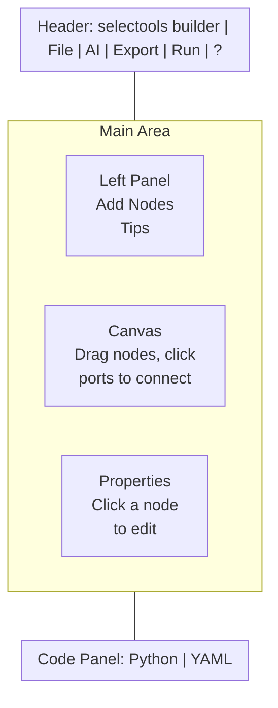

# Visual Agent Builder

The selectools builder is a drag-and-drop graph editor that runs entirely from `pip install selectools` — no separate server, no CDN, no build step.

**Try it now** — no install required: [**Open the builder on GitHub Pages**](https://selectools.dev/builder/)

Or run it locally:

```bash
selectools serve --builder
# → http://localhost:8000/builder
```

Press **`?`** inside the builder at any time to open the built-in help panel.

---

## Starting the builder

```bash
# Basic (no auth — local development only)
selectools serve --builder

# With hot reload during development
selectools serve --builder --reload

# With token auth (recommended for any networked use)
selectools serve --builder --auth-token mytoken

# Custom host/port
selectools serve --builder --host 0.0.0.0 --port 8080

# Via uvicorn directly (for production flags)
uvicorn "selectools.serve._starlette_app:create_builder_app" --factory --port 8000
```

Auth token priority: `--auth-token` flag → `BUILDER_AUTH_TOKEN` env var → `~/.selectools/auth_token` dotfile.

---

## Interface overview



- **Left panel** — drag node types onto the canvas
- **Canvas** — build and inspect your workflow
- **Right panel** — edit the selected node's properties
- **Code panel** — live Python/YAML that updates as you build (click `▲ Code` to expand)

---

## Node types

| Node | Color | Purpose |
|------|-------|---------|
| **START** | Green | Entry point. Every graph needs exactly one. Receives the initial user message. |
| **Agent** | Cyan | An LLM-powered node. Configure provider, model, system prompt, and tools. |
| **Loop** | Orange | Repeats until an exit condition is met. Has `body` (continue) and `done` (exit) output ports. |
| **Subgraph** | Purple | Runs another `AgentGraph` as a nested step. Reference by graph name. |
| **Human Input** | Amber | Pauses and waits for human approval. Each option becomes an output port. Timeout auto-resumes. |
| **Agent Tool** | Violet | Wraps another agent as a callable `@tool`. Use an entire workflow inside another agent. |
| **Retriever (RAG)** | Cyan | Vector-store-backed retrieval node. Pick one of 7 backends (memory / SQLite / Chroma / Pinecone / FAISS / Qdrant / pgvector), configure embedding provider, `top_k`, score threshold. Toggle Hybrid (BM25 + vector + RRF) and cross-encoder Rerank. Generates a `VectorStore` + `RAGTool`/`HybridSearchTool`; any agent downstream of the retriever gets the tool auto-attached. |
| **Session Store** | Violet (dashed) | Resource node for `SessionStore`. Pick backend (JSON file / SQLite / Redis / Supabase), set default `session_id`, namespace, TTL. No edges — select it from the **Session Store** dropdown on any Agent panel to wire it into that agent's `AgentConfig`. |
| **Note** | Amber | Canvas annotation — Markdown, resizable, collapsible. Does not execute. |
| **END** | Red | Exit point. Connect any node here to terminate the flow. |

---

## Building a workflow

### 1. Add nodes

Drag a node type from the left panel onto the canvas. A **START** and **END** node are added automatically on first load.

### 2. Connect nodes

Click an **output port** (circle on the right side of a node), then click an **input port** (circle on the left side of the target node). A bezier edge appears.

- Click an edge to add a **condition label** (e.g. `approved`, `retry`, `done`)
- Hover an edge to **preview the last output** from that connection
- Port colors indicate type — cyan = text, purple = variable/subgraph, amber = HITL option
- Incompatible port types are greyed out and blocked

### 3. Edit a node

Click any node to open its properties in the right panel:

- **Agent node**: Name, Provider (OpenAI / Anthropic / Gemini / Ollama), Model, System Prompt, Tools
- **Loop node**: Max iterations, Exit condition
- **Subgraph node**: Graph name to invoke
- **HITL node**: Option labels (each becomes an output port), timeout
- **Note**: Markdown text, color

### 4. Test it

Click **▶ Run**, enter a test message, and click **Run** in the panel. Responses stream in real time with the full tool-call trace visible.

---

## Header buttons

### File ▼

| Item | What it does |
|------|-------------|
| New (Clear) | Reset the canvas |
| Load Example | Load a pre-built example graph |
| Templates | 9 starter templates: Simple Chatbot, Researcher + Writer, RAG Pipeline, Hybrid RAG (BM25 + vector + rerank), Multi-Tenant RAG (session-scoped), Reviewer Loop, HITL Approval, Multi-Model Panel, Chain of Thought |
| Import YAML / Python… | Paste `AgentGraph` Python or YAML to load onto the canvas |
| Watch File… | Point to a `.py` file — canvas reloads every time you save it |

### ✨ AI

Type a plain-English description of your workflow and click **Generate**. The AI creates nodes and connections for you. You can then iterate using the **AI tab** in the test panel.

Examples:
- `"A chatbot that searches the web before answering"`
- `"Researcher writes a report, reviewer gives feedback, loop until approved"`

### Export ▼

| Item | What it does |
|------|-------------|
| Python | Download runnable `AgentGraph` Python — works without selectools installed (no lock-in) |
| YAML | Download graph as YAML |
| Embed Widget | Get an `<iframe>` snippet to embed a chat widget on any page |
| Load Trace | Paste `trace_to_json(result.trace)` output to replay a production run in the scrubber and Gantt chart |

---

## Testing & debugging

### Test panel tabs

**Output** — Streaming response from the workflow with the full tool-call trace (tool name, input, output per step).

**History** — Every previous run, searchable. Click any run to replay it. Export all runs as JSONL.

**AI** — Chat with the AI copilot to modify the workflow. Examples:
- `"Add a step that summarizes the output"`
- `"Make the reviewer agent stricter"`

### Scrubber

After a run, an execution scrubber appears above the output. Click any step to highlight the corresponding node on the canvas. Click ▶ next to any step to **re-run from that checkpoint**.

### Gantt timeline

Click **📊 Timeline** to see a Gantt chart of the run — each bar represents one node's execution time. Hover for token count and cost breakdown.

### Right-click menu

Right-click any node for:
- **Re-run in isolation** — run only this node with the last inputs it received
- **Pin last output** — lock the output so downstream nodes always receive it (useful for debugging)
- **Freeze / unfreeze** — skip re-execution and use the cached output

### Loading a production trace

```python
from selectools import Agent, trace_to_json

agent = Agent(...)
result = agent.run("Hello")

# Copy this output
print(trace_to_json(result.trace))
```

Paste the JSON into **Export → Load Trace** in the builder to replay the exact execution — including timing, token counts, and tool calls.

---

## Code panel

Click **▲ Code** at the bottom of the screen to expand the live code view.

The **Python** tab shows a complete, runnable `AgentGraph` script that stays in sync as you edit nodes. The **YAML** tab shows the graph in YAML format.

Both can be copied or downloaded. The generated Python runs standalone:

```bash
pip install selectools
python my_workflow.py
```

---

## Canvas navigation

| Action | How |
|--------|-----|
| Zoom in / out | Scroll wheel (zooms toward cursor) |
| Zoom in / out | `+` / `-` keys |
| Zoom to fit | `Ctrl+0` or the `⟳` button |
| Pan | Hold `Space` + drag |
| Pan | Middle-mouse drag |
| Zoom buttons | `+` / `−` / `⟳` in the bottom-right corner |

---

## Keyboard shortcuts

| Shortcut | Action |
|----------|--------|
| `Ctrl+Z` / `Cmd+Z` | Undo |
| `Ctrl+Y` / `Cmd+Y` | Redo |
| `Ctrl+C` / `Cmd+C` | Copy selected node |
| `Ctrl+V` / `Cmd+V` | Paste node |
| `Del` or `Backspace` | Delete selected node or edge |
| `Esc` | Cancel connection / deselect / close modal |
| `Cmd+K` | Search nodes by name |
| `+` / `-` | Zoom in / out |
| `Ctrl+0` / `Cmd+0` | Reset zoom to 100% |
| `?` | Open help panel |

---

## Embed widget

**Export → Embed Widget** generates an `<iframe>` that embeds a live chat interface for your workflow on any web page.

```html
<iframe src="http://localhost:8000/builder?embed=1&graph=BASE64"
        width="400" height="600" frameborder="0"></iframe>
```

The `?graph=` parameter encodes your workflow so the embedded widget always loads the right graph. The embed view hides all editor chrome — users only see the chat interface.

---

## Bidirectional sync (Watch File)

**File → Watch File** lets you edit Python in your editor and see the canvas update live:

1. Export your graph as Python (`Export → Python`)
2. Edit the file in your editor
3. Open **File → Watch File** in the builder and point to the file
4. Every save triggers a canvas reload

Changes on the canvas also update the code panel in real time.

---

## Auth configuration

| Method | How |
|--------|-----|
| CLI flag | `selectools serve --builder --auth-token TOKEN` |
| Environment variable | `BUILDER_AUTH_TOKEN=TOKEN selectools serve --builder` |
| Dotfile | `echo TOKEN > ~/.selectools/auth_token` |

With auth enabled, visiting the builder redirects to `/login`. Sessions are HMAC-signed cookies — no database required.

For multi-user setups with GitHub OAuth and RBAC, set `GITHUB_CLIENT_ID` and `GITHUB_CLIENT_SECRET` environment variables.

---

## GitHub Pages (serverless mode)

The builder works without a server. When hosted on GitHub Pages or any static host, it auto-detects the missing backend and enables client-side mode:

- **AI Generate** — keyword matching fallback (no API key) or direct OpenAI calls from the browser (with API key)
- **Mock test runs** — fully client-side, no server needed
- **Live test runs** — calls OpenAI directly from the browser with streaming, eval checks, and cost tracking
- **File watch / AI copilot** — disabled with helpful messages (requires local server)

API keys entered in the browser are stored in the session only and never sent to any server other than OpenAI.

---

## Architecture

The builder is assembled from three source files at import time:

```
src/selectools/serve/
├── _static/
│   ├── builder.html     # HTML skeleton ({{CSS}} and {{JS}} placeholders)
│   ├── builder.css      # All CSS — editable with IDE support
│   └── builder.js       # All JS — lintable, formattable
├── builder.py           # 17-line loader → assembles BUILDER_HTML
├── _starlette_app.py    # Starlette ASGI app (19 routes, async)
├── app.py               # Stdlib HTTP server (fallback)
└── cli.py               # CLI entry point
```

The CLI prefers **Starlette + uvicorn** when installed (`pip install selectools[serve]`), falling back to stdlib `http.server` otherwise. The Starlette app supports `CORSMiddleware`, async SSE via `StreamingResponse`, and proper ASGI deployment with gunicorn.

---

## Example scripts

- `examples/76_visual_builder.py` -- start the builder programmatically

---

## Related Examples

| # | File | Description |
|---|------|-------------|
| 76 | [`76_visual_builder.py`](https://github.com/johnnichev/selectools/blob/main/examples/76_visual_builder.py) | Start the visual builder programmatically |

!!! tip "See Also"
    - [Serve Module](SERVE.md) -- HTTP API server that hosts the builder
    - [Templates Module](TEMPLATES.md) -- YAML config and pre-built agent templates
